SDMX GUIDELINES

**GUIDELINES FOR THE DESIGN OF DATA STRUCTURE DEFINITIONS**

VERSION 1.0

10 June 2013

© SDMX 2013

http://www.sdmx.org/

# Contents

[1 Aim of this document](#1-aim-of-this-document)

[2 General Design Principles](#2-general-design-principles)

[2.1 Reuse of existing DSDs and code lists](#21-reuse-of-existing-dsds-and-code-lists)

[2.1.1 Identify existing DSDs and code lists](#211-identify-existing-dsds-and-code-lists)

[2.1.2 Priority ranking of existing DSDs and code lists](#212-priority-ranking-of-existing-dsds-and-code-lists)

[2.1.3 Suitability of available DSDs and code lists](#213-suitability-of-available-dsds-and-code-lists)

[2.2 Flexibility and future needs](#22-flexibility-and-future-needs)

[2.3 Structural principles](#23-structural-principles)

[2.3.1 Parsimony](#231-parsimony)

[2.3.2 Simplicity](#232-simplicity)

[2.3.3 Purity](#233-purity)

[2.3.4 Density and sparseness](#234-density-and-sparseness)

[2.3.5 Unambiguousness](#235-unambiguousness)

[2.3.6 Exhaustiveness](#236-exhaustiveness)

[2.3.7 Orthogonality](#237-orthogonality)

[2.3.8 User-friendliness](#238-user-friendliness)

[2.3.9 Fitness for use throughout the statistical business process](#239-fitness-for-use-throughout-the-statistical-business-process)

[3 Usage contexts](#3-usage-contexts)

[3.1 Type of data](#31-type-of-data)

[3.2 Domain](#32-domain)

[3.3 Purpose](#33-purpose)

[3.4 Type of data exchange and recipient](#34-type-of-data-exchange-and-recipient)

[3.5 Role in data exchange](#35-role-in-data-exchange)

[3.6 Process pattern](#36-process-pattern)

[3.7 Phase in statistical business process](#37-phase-in-statistical-business-process)

[4 Data structuring approaches](#4-data-structuring-approaches)

[4.1 Number and content of concepts](#41-number-and-content-of-concepts)

[4.2 Number and relations of DSDs](#42-number-and-relations-of-dsds)

[5 Minimum structural and semantic requirements](#5-minimum-structural-and-semantic-requirements)

[5.1 Required and recommended dimensions and attributes](#51-required-and-recommended-dimensions-and-attributes)

[5.2 Attribute attachment levels and definition of groups](#52-attribute-attachment-levels-and-definition-of-groups)

[5.3 Header elements](#53-header-elements)

[6 Step-by-step guide](#6-step-by-step-guide)

[6.1 High-level overview of the process](#61-high-level-overview-of-the-process)

[6.2 Defining modified DSDs](#62-defining-modified-dsds)

[6.3 Defining new DSDs](#63-defining-new-dsds)

[6.4 Checklist for DSD Designers](#64-checklist-for-dsd-designers)

[7 Annex 1. Glossary of Terms](#7-annex-1-glossary-of-terms)

[8 Annex 2. What is a DSD?](#8-annex-2-what-is-a-dsd)

[9 Annex 3. References](#9-annex-3-references)

[9.1 SDMX Documents](#91-sdmx-documents)

[9.1.1 Existing documents](#911-existing-documents)

[9.1.2 Not yet available documents](#912-not-yet-available-documents)

[9.2 Non-SDMX Documents](#92-non-sdmx-documents)

# 1 AIM OF THIS DOCUMENT

The development of global Data Structure Definitions (DSDs) by the SDMX consortium and similar efforts by individual SDMX sponsor organizations and other international organizations to enable the broader adoption of the SDMX standard for data collection, exchange, and dissemination raise a need for standards or at least common guiding principles and recommendations. This document provides such guidelines based on conceptual considerations and first hand experiences with global DSD development. It does so by taking into account the specific requirements of different usage contexts. For example, DSDs may target:

- different types of data, e.g., micro data and macro data (cross-sectional and time series);
- different data exchange scenarios such as exchange at the national level, collection of international organizations from national member organizations, exchange between international organizations, dissemination to the general public; and/or
- different types of intended recipients, for instance in machine-to-machine or machine-to-user communication.

Different approaches to structuring data serve the varying needs of these different usage contexts to different extents. Therefore, this document presents different data structuring approaches and discusses their pros and cons in different situations instead of prescribing “the best” one-size-fits-all approach. It concentrates on the exchange of macro data; micro data are not covered.

Target audiences for these guidelines include domain experts and official statisticians involved in DSD development. Thus focusing on the business/content side of DSD development, the document tries to avoid technical jargon when explaining underlying concepts and ideas, but tries to still be useful for IT experts supporting SDMX implementations. Ideally, the document can bridge the gap between IT and statistical experts. The scope of the guidelines is restricted to conceptual aspects. Organizational and technical aspects are treated in separate documents.

- Code lists are the crucial building blocks of data structure definitions. Especially in the case of SDMX recommended code lists (particularly for cross-domain concepts; see SDMX Content Oriented Guidelines under “Guidelines” at http://sdmx.org/), list development and maintenance as well as DSD development and maintenance are carried out by different organizations at different points in time. For example SDMX recommended code lists for frequency and observation status already exist and should be used by reference in DSDs. While “SDMX” is responsible for the maintenance of these code lists, the DSD developing organization will be responsible for the maintenance of the DSD, that is, for the structure at a higher level. (Of course, a global DSD may also have “SDMX” as maintenance agency.) In any case, there is a strong interrelationship between DSD and code list development and maintenance (see SDMX Guidelines for the creation and maintenance of code lists under “Guidelines” at http://sdmx.org/).
- Maintenance and governance rules for DSDs including issues of updating, versioning, retiring as well as questions of responsibilities, especially relevant in the context of global DSDs jointly developed by multiple organizations and maintained by “SDMX” (or multiple organizations), will be covered by separate guidelines (see “Guidelines” at http://sdmx.org/).
- Issues related to SDMX registries (in general, and the global SDMX registry in particular) such as storage, federation, and registration of, as well as search for, retrieval and download of, code lists and DSDs are not in the scope of this document. For more information on the registry see the “Standards” page at http://sdmx.org/.
- Guidelines for the development, maintenance, and governance of metadata structure definitions (MSDs) will be made available separately under “Guidelines” at http://sdmx.org/.
- Documentation on more IT-related issues is available at the SDMX IT tools and SDMX tutorials site at http://sdmx.org/?page\_id=13. The SDMX Tools Repository can be accessed at http://www.sdmxtools.org/. Many of the SDMX tools listed and described there are available free of charge.

This document is structured as follows. Section 2 outlines general design principles of DSDs. Section 3 discusses different usage contexts of DSDs in more detail. Section 4 gives an overview of different data structuring approaches including benefits, drawbacks, and context-specific recommendations. General minimum structural and semantic requirements are discussed in section 5. Section 6 provides a step-by-step guide to designing DSDs including a checklist for DSD designers. The three annexes include a glossary in Annex 1, a definition and brief introduction of the core components of a DSD in Annex 2, and a list of references in Annex 3.

# 2 GENERAL DESIGN PRINCIPLES

Besides the evident requirement of *standard compliance*, a couple of general design principles apply to SDMX DSD development independently of the domain and the particular usage context the DSD is embedded in. Examples include *flexibility in changing requirements*; *stability*; *usage of existing* code lists or even DSDs; and *parsimony*, *simplicity*, *unambiguousness*, and *density* of the dimensional model. Please note that the SDMX-ML Standards do not impose an order on concepts (i.e., dimensions and attributes). Strictly speaking, standard compliance of a DSD only entails technical compliance with the SDMX technical standard. However, *adherence to* SDMX content recommendations, principles, and best practices as provided in the *SDMX Content-Oriented Guidelines* (see http://sdmx.org/?page\_id=11) is strongly recommended. It should be kept in mind that one major aim of SDMX is to have transparency and agreement on the meaning of statistical concepts in order to allow their flawless communication.

## 2.1 Reuse of existing DSDs and code lists

Whenever a DSD is required to exchange data according to the SDMX standard, the *reuse of existing DSDs and code lists* should be the first guiding principle. As far as possible, this reuse should be accomplished by referring to the existing artefacts, not by creating independent copies. What needs to be considered, though, is the handling of updates of the reused DSD or code lists in the new DSD (or data flow or data provision agreement). This heavily depends on the guidelines for the maintenance of code lists (provided as a separate document) and to what extent the maintenance agency follows these guidelines.

In case of artefacts with maintenance agency “SDMX” or one of the sponsor organizations, reasonable versioning of artefacts and availability of old versions can be expected, as these organizations have a genuine interest in fostering the usage, and thus maintenance, of the SDMX standard and its artefacts. This means that by referring to a certain version of a code list or DSD, the new structure will not change automatically when a new version of the code list or DSD that was included by reference becomes available. Rather, re-users of the (now modified) code list or DSD have full control whether they want to modify their artefacts by pointing to the new version. In case of more local maintenance agencies (with potentially less compliance to the SDMX Content-Oriented and other Guidelines) it may make sense to maintain a separate copy of the artefacts to be reused, this way circumventing issues with less dependable sources. As stated in the introductory section, questions of the maintenance of DSDs and notification mechanisms for SDMX artefacts are discussed in separate documents.

### 2.1.1 Identify existing DSDs and code lists

The Global SDMX Registry (currently under development) is the primary location to search for global SDMX artefacts, especially DSDs, MSDs, SDMX cross-domain concepts and code lists, and domain specific concept schemes and code lists used by global DSDs. It includes artefacts with maintenance agency “SDMX” as well as artefacts maintained by sponsor organizations. Usage of the Global SDMX Registry is explained in a separate document. In addition, sponsor organizations, other international and national organizations may have their own SDMX registries or other ways of distributing their code lists, DSDs, and MSDs on their websites.

### 2.1.2 Priority ranking of existing DSDs and code lists

Regarding reuse of existing DSDs, global DSDs with “SDMX” or SDMX sponsor organization(s) as maintenance agency have priority. If a suitable global DSD does not exist, the usage of other already available DSDs is to be considered. For example, in case of the development of a new global DSD, a DSD already in use by a number of international organizations may work well. This is not a recommendation for having an automatism for de facto standards becoming SDMX standard; the internationally agreed DSD could be considered as a starting point for the working group that develops the global DSD. Departmental DSDs are considered the lowest priority; their usage is merely adequate for data exchange within an institution or as a basis for developing a harmonized DSD for inter-organizational exchange. Overall, priority should be given to existing DSDs in the following order:

- global DSDs with maintenance agency “SDMX”;
- global DSDs with SDMX sponsor organization(s) as maintenance agency;
- other internationally agreed DSDs;
- nationally agreed DSDs;
- DSDs used by the organization;
- DSDs used by the department.

If none of the available DSDs is appropriate, it is still possible that existing concepts and/or code lists may be reused. (Only if the required concepts and code lists do not exist at all, a completely new DSD has to be developed with new concepts and new code lists.) Priority should be given to existing code lists in the following order:

- code lists recommended by the SDMX COG;
- other ISO code lists;
- code lists used by many SDMX sponsor organizations;
- other internationally agreed code lists;
- nationally agreed code lists;
- organization-wide code lists;
- departmental code lists.

The same disclaimers hold for code lists as for DSDs. Code lists used by many sponsor organizations or other internationally agreed code lists are a great basis for developing SDMX recommended code lists, and they can be used for data exchange if agreed by all parties. It is not suggested that they are accepted as SDMX recommended code lists automatically. Departmental code lists are considered the lowest priority. Their usage should be avoided wherever possible, but is acceptable for data exchange within an institution or as a basis for developing a harmonized code list for inter-organizational exchange.

### 2.1.3 Suitability of available DSDs and code lists

In case an existing DSD is close to but differs from what is needed, it may: (i) contain irrelevant concepts, (ii) lack some required concepts, (iii) use the concepts in different roles than required, (iv) deviate with respect to some of the code lists, or (v) contain pure dimensions when mixed dimensions would make more sense or vice versa. More complex situations that are combinations of several (or even all) of these five cases may occur as well. For example, an existing DSD could contain unnecessary concepts and lack other concepts at the same time.

#### 2.1.3.1 Irrelevant concepts

Two options exist to deal with the situation of only a subset of dimensions being relevant<a href="#fn-1" id="fnref-1">1</a>:

1. define a new, reduced concept scheme that includes only the relevant concepts and code lists by reference and a new DSD that uses the reduced concept scheme;
2. reuse concept scheme, code lists, and DSD, but add constraints to the data flow definition (or to the DSD, but this would also make it a new, derived DSD) that set the irrelevant dimensions to whatever applies from the following:

   a. If a concept is irrelevant because all observations take a particular value in that dimension or attribute, the concept should be restricted to that value via constraints in the data flow. For example “Unit” may be a dimension in a DSD because the data are disseminated in national currency, US Dollars, and percent change, but the new data exchange only allows US Dollars. Then the concept could be assigned to the attribute role (instead of the dimension role) which would entail defining a new DSD. This is not desirable if it can be avoided. Instead, the dimension can be kept and a constraint for “Unit” = US Dollars added.

   b. If a concept is obsolete because only total values aggregated over the corresponding dimension are relevant, the dimension (or code list) should be restricted to a “total” item. For instance, an existing DSD on bilateral trade contains “Partner Country” as dimension, since data are collected with a breakdown by country of trade counterpart. The new data exchange disseminates similar data, but only the trade totals “vis-à-vis all countries”.

   c. If a concept is not needed because it cannot even be relevant for the data at all or because an additional breakdown is just not available, the concept should be restricted to “not applicable” or “unknown” via constraints. For example, a financial instrument breakdown was not collected and it is unclear whether data for all or only for some financial instruments were included, that is whether the “total” value can be used. In this case, the dimension would be restricted to “unknown”. Consider another simple example of a DSD that contains, amongst others, the two dimensions “Unit of Measure” and “Base Period”. The code list for “Unit of Measure” consists of percent per annum, percentage, and index with base year=100. “Base Period” can contain dates, years, months, etc. If the new data exchange restricts “Unit of Measure” to percent per annum, “Base Period” becomes obsolete and should be constrained to “not applicable”.

#### 2.1.3.2 Missing concepts

In this case additional concepts (and possibly code lists) are required, for example to accommodate an additional cross-classification. One option is to adapt the existing DSD to satisfy the new needs, i.e., create a new version of the DSD by adding the concepts, dimensions/attributes, and code lists. The feasibility of this solution depends on the relation between the organization requiring the new data structure and the organization maintaining the existing DSD, and the relation between the two usage contexts. The original, restricted model needed for the existing data flows can be specified by means of constraints, as described above for irrelevant concepts, or by referring to the original version of the DSD.

If a modification of the existing DSD does not make sense or is not possible, the relevant concepts and code lists should be reused, but an extended concept scheme, an extended (new) DSD, and maybe also additional code lists need to be defined. If a code list already used by the DSD applies to the new dimension/attribute, it can be reused. An example is the inclusion of a “Partner Country” breakdown for which the already defined “Reference Area” code list can be reused. If additional code lists are necessary, again different scenarios are feasible:

1. The required code list is available somewhere else. In this case the priority ranking provided above should be applied. For instance if an additional sector breakdown is required, the sector code list defined in the global DSD for National Accounts can be referred to.
2. A code list similar to what is needed is available somewhere else.

   a. If only a subset of the existing code list is relevant, the code list can be reused with a constraint imposed either on the code list, or in the DSD, or in the data flow definition (or in the data provisioning agreement). It is also possible to use the entire code list but only report data for the subset.

   b. In case a (different) hierarchy is needed, the underlying flat code list can be referenced and a new hierarchical code list introduced. This means that a flat code list (i.e. without an explicitly defined hierarchy) is available that meets the coverage requirements, but that the existing hierarchy defined on top of the flat code list deviates from the required hierarchy. Hence, the suitable flat code list can be reused, but a new hierarchical code list needs to be defined. Consider for instance the “Reference Area” code list as recommended by the SDMX Content-Oriented Guidelines (COG), i.e. containing ISO-2-character codes for countries. Different groupings of these countries are relevant in different contexts, for example, regional aggregates by continent, by income level, or by membership in certain international groups (e.g. monetary unions). A flat code list can be defined that contains all these country groups in addition to the individual countries. This list does not specify parent-child relationships between groups and countries, as this would entail repeating countries for each group they belong to. It basically provides the value domain for a geographic dimension, but not the semantics of the values in terms of the group composition. On top of this flat code list, different hierarchical code lists can be defined that may use the complete set of codes or just a subset thereof. The flat code list can be referenced by any DSD with a geographical reference, and different DSDs can build their own hierarchical code lists based on the flat list.

   c. If additional items are needed, a derived code list can be specified by including each element from the existing code list by reference and adding the new elements as required. The current versions of the SDMX Technical Standard do not allow combining existing code lists into one or referencing an entire code list and adding a few elements to be managed in the new code list. Often, simply a copy of the existing list is introduced as new code list with the new items included. This is not optimal, as conceptually identical items have to be managed in multiple code lists. At least in theory it is also possible to just create a new version of the existing code list with the additional items. Existing data flows would then either use the original version of the code list or the new version with constraints, whereas the new version of the code list would be used in the new data flow. Again, this option depends on the organizational background. Consider as an example the inclusion of “Currency” into a DSD with a need for codes for “Domestic currency” and “Foreign currency” in addition to the codes specified in the code list recommended by the SDMX COG. In the first option, the currencies from the recommended code list are included by reference and the two new items added to a new code list. This is superior to the common practice of including copies of the existing codes (the currencies) instead of references. This makes the new code list more independent of the existing one, but it increases the maintenance cost and the risk of inconsistencies. Another option is to extend the existing code list by creating a new code list version. In the currency example, the SDMX consortium as the owner of the recommended code list would need to decide whether this new version should be created or not.

3. No appropriate code lists are available. New code lists have to be defined based on the guidelines for the development of code lists. This may often be the case for domain-specific code lists, especially in new areas of investigation.

#### 2.1.3.3 Concepts in different roles

In this case concepts are available in other roles than required, for example what needs to be a dimension is merely an attribute or vice versa. This case is already briefly discussed above as part of the first case (“irrelevant concepts”). Basically, a new DSD has to be defined. It can reuse the concept scheme and code lists, but specifies the concepts in the new DSD as dimensions or attributes as required. In case an attribute needs to become a dimension, it may be necessary to define a new code list for that dimension in case it did not exist previously.

An example for an attribute having to be redefined as a dimension may be the “Unit of measure” that is frequently just specified as an attribute. If certain indicators are presented in different units in the same data flow, the corresponding DSD must contain “Unit of measure” as dimension, though.

#### 2.1.3.4 Different code lists

In this case the new requirements differ from the existing DSD with respect to some of the code lists, either by only a subset of codes being relevant, by a deviating hierarchical structure, or by necessitating additional codes. These three scenarios are discussed above as special cases of the “missing concepts” case. In theory, just defining a new code list whenever an existing one is not completely appropriate is also possible (but not desirable). However, this means that the overlapping items have to be managed in multiple code lists unless they are included by reference. Also, different DSDs have to be maintained. If the constraints are neither imposed at the code list nor at the DSD level, but at the data flow level, the DSD is simply reused. This is highly recommended. The cost of maintaining multiple DSDs or multiple, largely overlapping code lists can be high. The lack of harmonization has one advantage, though: the increased maintenance and versioning flexibility. For global data exchange, this is not regarded as a reasonable solution.

#### 2.1.3.5 Pure vs. mixed dimensions

The design principle of pure dimensions is explained in more detail in subsections 3.3 and section 4 on data structuring approaches. If an existing DSD does not have the desired degree of dimension purity, it is necessary to further decompose and/or combine dimensions of that DSD. This will lead to a new derived DSD and also requires the definition of new (combined or split) code lists, unless they are available from elsewhere.

## 2.2 Flexibility and future needs

As already mentioned in the initial statement of this section, DSD design should take into account *potential future needs*. A DSD should be flexible enough to accommodate changing requirements and still remain as stable as possible for a reasonable time period (e.g. five years). Given the possibly high development and implementation costs, users should be able to rely on a stable DSD as a data exchange standard for a certain data flow. Changes in DSDs may have implications for data providers' and consumers' processes and may incur adjustment costs.

This future-orientation may require the introduction of a dimension that is not relevant at the time of DSD design but known (or suspected) to become relevant despite the (at least) temporary redundancy of the additional dimension. For example, it may be likely that certain additional variables will be introduced in a data collection instrument in the future. Even if it is unknown whether this will really happen and if so, when, it is reasonable to include those additional concepts in the DSD from the beginning and use a “total” or “not applicable” value for that concept until it gets implemented in the data collection exercise.

## 2.3 Structural principles

In terms of the data structure itself, *parsimony*, *simplicity*, *exhaustiveness*, *unambiguousness*, *orthogonality*, and *density* of the dimensional model should be taken into account.

### 2.3.1 Parsimony

A *parsimonious* DSD does not contain any redundant dimensions that are not needed to uniquely identify a data point. It may contain concepts that are not needed for data identification, but those take the role of attributes that further describe observations. It attaches those attributes at the highest possible level, i.e. to groups of observations that share the same value of an attribute. For example, if all data for Country “Canada” are provided in “Canadian Dollars”, for “US” in “US Dollars”, etc., the Unit may be defined as an attribute at Country level. This means it only has to be specified once for each value of Country.

### 2.3.2 Simplicity

A *simple* DSD is often considered as one that keeps the observation keys (or identifiers) as short as possible by keeping the number of dimensions to the absolute minimum. This is related to the parsimony of DSDs, but typically goes beyond that by using what is often called “mixed dimensions”, i.e., dimensions that combine different concepts. If this idea were taken to an extreme, there would be only one dimension containing an observation key.

### 2.3.3 Purity

The *purity* of concepts, especially dimensions, is a principle that is in conflict with the aim of DSD simplicity. Pure dimensions only relate to one pure concept, not to a combination of concepts. They usually have shorter and less complex code lists than “mixed dimensions”. Balancing these two antagonistic principles can be difficult; it is discussed in more detail and with a few examples in section 4 on data structuring approaches.

### 2.3.4 Density and sparseness

The *density* of a DSD is closely related to its simplicity whereas *sparseness* often comes along with purity. For a dense DSD, a data flow provides data for all (or the large majority of) cells defined by the Cartesian product<a href="#fn-2" id="fnref-2">2</a> of the DSD dimensions. This is typically the case for simple DSDs. For pure DSDs with many dimensions, it is usually not feasible to share data for the entire data space created by the combination of all dimensions.

For example, a breakdown by “Institutional Sector” or “Gender” may only make sense for a subset of the “Indicators” provided. The sparseness may be measured in terms of the number of dimensions requiring a “not applicable” value or the number of observations that take at least one “not applicable” or “total” value (both as shares of the total number of dimension or the total number of observations, respectively)<a href="#fn-3" id="fnref-3">3</a>. An even more precise measure of sparseness is the proportion of theoretically possible key combinations that are irrelevant or not feasible or do not carry data.

### 2.3.5 Unambiguousness

Another important DSD design principle is *unambiguousness*. It should be avoided that one observation can be expressed by multiple combinations of dimension values (keys). This may occur when multiple dimensions are used to express similar or even overlapping concepts. To illustrate the principle of unambiguousness, consider the following example with four dimensions (apart from country and time) and value domains as depicted in Table°1.

**Table 1. Unambiguousness example – dimensions**

<table>
<tr><th><strong>Indicator</strong></th><th><strong>Measurement</strong></th><th><strong>Unit</strong></th><th><strong>Scale</strong></th></tr>
<tr><td>GDP</td><td>Current prices</td><td>National</td><td>Units</td></tr>
<tr><td>&nbsp;&nbsp;&nbsp;GDP nominal</td><td>&nbsp;&nbsp;&nbsp;Millions of national currency, current prices</td><td>currency</td><td>Thousands</td></tr>
<tr><td>&nbsp;&nbsp;&nbsp;GDP real</td><td>&nbsp;&nbsp;&nbsp;Millions of US $, current prices</td><td>US $</td><td>Millions</td></tr>
<tr><td>&nbsp;&nbsp;&nbsp;GDP deflator</td><td>Constant prices</td><td>Index</td><td>Billions</td></tr>
<tr><td>Consumer prices</td><td>&nbsp;&nbsp;&nbsp;Millions of national currency, constant prices</td><td>Euro</td><td>…</td></tr>
<tr><td>…</td><td>&nbsp;&nbsp;&nbsp;Millions of national currency, 2005 prices</td><td>Euro, 2005</td><td></td></tr>
<tr><td></td><td>&nbsp;&nbsp;&nbsp;Millions of US $, constant prices</td><td>US $, 2005</td><td></td></tr>
<tr><td></td><td>&nbsp;&nbsp;&nbsp;Millions of US $, 2005 prices</td><td>US $, 2010</td><td></td></tr>
</table>

How would an observation of “Gross domestic product, volume, US dollars, reference year = 2005, millions” for the United States be represented with these dimensions? Table 2 provides three different possible representations (there may be even more).

**Table 2. Unambiguousness example – ambiguous representations**

<table>
<tr><th><strong>Indicator</strong></th><th><strong>Measurement</strong></th><th><strong>Unit</strong></th><th><strong>Scale</strong></th></tr>
<tr><td>GDP</td><td>Constant prices</td><td>US $, 2005</td><td>Millions</td></tr>
<tr><td>GDP real</td><td>Millions of national currency, 2005 prices</td><td>US $</td><td>Units</td></tr>
<tr><td>GDP</td><td>Millions of US $, constant prices</td><td>US $, 2005</td><td>Millions</td></tr>
</table>

In this simplified example, there are several ways of resolving the ambiguity. In practice, overlaps and ambiguities are often less obvious and finding an unambiguous solution may be less straightforward.

### 2.3.6 Exhaustiveness

An *exhaustive* DSD includes every piece of information that is required to unambiguously represent a data point and to correctly interpret it outside its usual context. It may not be necessary to specify the respective concepts as dimensions, but if they are attributes they should be made mandatory. For instance it may be absolutely clear that all data in a certain database are measured in millions of Euros, but once the data are shared and thus available outside the context of the original database, how would a consumer of those data know - unless s/he is told so?

### 2.3.7 Orthogonality

*Orthogonality* of DSD dimensions corresponds to the independence of the meaning of a value of one dimension from the values of any other dimensions. Orthogonality helps to avoid ambiguity. In the example for lacking unambiguousness above, the dimensions are not orthogonal but show a semantic overlap that leads to dependencies between the dimensions.

For instance, dimensions “Indicator” and “Measure” are dependent; indicator “GDP real” cannot be combined with any of the “Current prices” measures. Another example from the tables above is “Scale” and its dependence on “Measurement” and “Unit of measure”. “Unit” combined with “Current prices” and “US $” really means “Unit”, i.e. the indicator is presented in (units of) US $, current prices; but if “Unit” is combined with “Millions of US $, current prices” and some “Unit of measure”, the indicator is presented in millions of (units of) US $, current prices. The meaning of “Scale” equal to “Unit” changes in dependence of the values of the other dimensions.

### 2.3.8 User-friendliness

The *user-friendliness* of a DSD may also be regarded as a general design principle. It is often said to increase with the simplicity of a DSD, but this is not necessarily the case. User-friendliness of a DSD mainly depends on the data sharing context, on the tools used to deal with the DSD and the data, and on the role of the user (e.g. the requirements of a DSD manager may be different from those of a researcher looking for certain time series in a disseminated dataset). While a simple DSD consisting of a few dimensions only may be easier to understand by a human data consumer, a more complex, but purer DSD is typically more flexible in terms of further usage in automated processes. These aspects are discussed in more detail in the following sections.

### 2.3.9 Fitness for use throughout the statistical business process

Another DSD requirement is its *fitness for use throughout the entire statistical business process*, that is, at least from data collection through processing to exchange and dissemination. This means that data producers', consumers', and metadata mangers' needs should be taken into account in the design process. The requirements may diverge as more detailed data may often be collected than disseminated. Similarly, data sharing at the national level may be more granular or require somewhat different code lists than data sharing between national and international organizations or data sharing on the web for the general public. This divergence can be addressed by means of a “master DSD” and related “satellite DSDs”. The master DSD has all concepts and code lists that are required throughout the process. The satellite or sub-DSDs are derived from the master DSD and refer to the same concepts and code lists, but specify constraints (and possibly structure maps) to restrict the DSD to what is needed at a certain stage in the process. This helps maximize the extent to which artefacts are shared between the DSDs, and hence harmonized.

# 3 USAGE CONTEXTS

Different DSD usage contexts have specific requirements and different data structuring approaches suit these requirements to varying extents.

## 3.1 Type of data

For example, *time series* data require Time to be a dimension in the data structure definition, while it may just be a (mandatory) attribute for *cross-sectional* data. Similarly, *micro data* (not covered by this document) need a dimension that uniquely identifies each observation unit, whereas aggregated data do not have this requirement.

## 3.2 Domain

A related distinction is the one between *single-* and *cross-domain* (or *multi-domain*) data structures. For cross-domain data it may be difficult to define a single DSD with “pure” concepts. Consider for instance a data structure that is supposed to cover selected labor market and trade indicators. Cross-domain concepts such as Reporting Country, Frequency, and Unit of Measure, obviously apply to both domains. Besides, the two domains may share additional classification concepts, e.g., the corresponding type of economic activity/product (agriculture, manufacturing, health, etc.).

Other relevant concepts differ between the domains, though. Labor market indicators may include breakdowns by gender or age, whereas trade statistics may contain additional cross-classifications by terms of trade or destination country. This raises a couple of questions: Should all concepts be put into one DSD, despite the applicability of some concepts to only one of the two domains? Should this be done by combining the relevant concepts into one dimension with a longer (and maybe hierarchical) code list? Or is it preferable to split the data structure into one DSD for each domain covered?

## 3.3 Purpose

Questions like these also apply to *multi-purpose* (as opposed to *single-purpose*) data structures. Multi-purpose data structures are typically used in different, related data exchange exercises (that may be represented by different data flows). They are used to collect and/or disseminate related data, typically in the same domain(s), by different organizations or by one organization.

An example for a multi-purpose scenario is a supra-national organization such as Eurostat or the ECB acting as a “data hub” for its member countries in terms of data exchange with international organizations like the IMF or the UN. In this scenario, for instance the ECB may collect data for its own purposes, but also for its member countries’ reporting duties to the IMF, the OECD, and the BIS. The data would (partially) be redistributed to the international organizations so national banks and statistics offices would not have to report the same (or very similar) data many times.

The global BOP DSD that is currently being developed may serve as a more specific example for a multi-purpose DSD. It is supposed to support, amongst others, exchange of the ECB's Balance of Payments (BOP) and International Reserves Template (IRT) data, Eurostat's International Investment Position (IIP) and Trade in Services (TS) data, the OECD's BOP data, and the IMF's Coordinated Portfolio Investment (CPIS) and Coordinated Direct Investment (CDIS) data.

Table 3 below shows some of the concepts considered relevant for some or all of these related data exchange exercises.<a href="#fn-4" id="fnref-4">4</a> Reporting Country and Unit of Measure are required by all data exchanges; the other concepts listed are only necessary (marked by an “X”) for a subset of the data exchanges. For instance, Eurostat's TS and IMF’s CDIS data do not require the distinction of flows and stocks, different maturities, or valuations (indicated by an “O”). Still, there is value in defining one master DSD that covers all concepts required for all of the data exchanges.

If that approach is pursued, satellite DSDs for the individual purposes (or exchange exercises) can be created via constraints (and/or structure maps). Each exchange exercise may also be represented as a data flow (the constraints may also be defined in the data flow instead of the DSD). So there would be one data flow defined for each column in the table below. For instance, the IMF CPIS data flow would restrict “Flows and stocks indicator” and “Valuation” to certain values from the respective code lists. Data provision agreements may then be set up for each data flow with each reporting country. Constraints can be used to restrict the contribution of each country to its own data, so “Reporting country” would be set to the respective value. If the constraints are defined in the data flow and/or structure maps are used to exclude irrelevant dimensions, the satellite DSDs do not materialize; they are “virtual” DSDs.

**Table 3. Excerpt of concepts and data exchange exercises relevant for the global BOP DSD (X=Yes)**

<table>
<tr><th rowspan="2"><strong>Concept</strong></th><th colspan="2"><strong>ECB</strong></th><th colspan="2"><strong>Eurostat</strong></th><th><strong>OECD</strong></th><th colspan="2"><strong>IMF</strong></th></tr>
<tr><th><strong>IRT</strong></th><th><strong>BOP</strong></th><th><strong>IIP</strong></th><th><strong>TS</strong></th><th><strong>BOP</strong></th><th><strong>CPIS</strong></th><th><strong>CDIS</strong></th></tr>
<tr><td><strong>Reporting country or area</strong></td><td>X</td><td>X</td><td>X</td><td>X</td><td>X</td><td>X</td><td>X</td></tr>
<tr><td><strong>Unit of measure</strong></td><td>X</td><td>X</td><td>X</td><td>X</td><td>X</td><td>X</td><td>X</td></tr>
<tr><td><strong>Flows and stocks indicator</strong></td><td>X</td><td>O</td><td>O</td><td>O</td><td>O</td><td>O</td><td>O</td></tr>
<tr><td><strong>Reporting sector</strong></td><td>X</td><td>X</td><td>X</td><td>O</td><td>X</td><td>X</td><td>X</td></tr>
<tr><td><strong>Financial instrument</strong></td><td>X</td><td>X</td><td>X</td><td>O</td><td>X</td><td>X</td><td>X</td></tr>
<tr><td><strong>Maturity</strong></td><td>X</td><td>X</td><td>X</td><td>O</td><td>X</td><td>X</td><td>O</td></tr>
<tr><td><strong>Valuation</strong></td><td>X</td><td>O</td><td>X</td><td>O</td><td>O</td><td>O</td><td>O</td></tr>
</table>

## 3.4 Type of data exchange and recipient

The type or *level of data exchange* also plays an important role. In terms of required concepts, data exchange *within an organization* may necessitate less context information (that is, less (mandatory) attributes) than data exchange *between organizations*. Referring to official standards may provide this context information as well, even for exchanges between organizations. International data exchanges, no matter if *among international organizations* or *between international organizations and national member organizations*, typically aim at cross-country comparisons of (highly) aggregated indicators. National data exchanges often require more detailed data structures (e.g., longer code lists or further concepts for additional breakdowns), alternative code labels (in national languages), or additional concepts that explain national methodologies that may differ from standard or recommended methodologies underlying standard code lists.

Data *dissemination to the general public* usually involves interaction with *human users* and hence requires less complex data structures and easier-to-grasp data discovery and retrieval mechanisms than *machine-to-machine* communication that is often used within and between organizations. As demonstrated by the recent emergence of Open Data initiatives, there is a growing demand to make data publicly available and to enable automated reading of data from the web via application programming interfaces (APIs).

## 3.5 Role in data exchange

In addition to the type of data exchange and the type of data recipient (machine or human), an actor's *role* determines whether certain features of data structuring approaches are regarded as pros or cons. A very complex DSD with many dimensions may be beneficial from a *data collection and processing* point of view because of its flexibility, but less attractive from the perspective of the *data provider* in the same data exchange. A data provider may find it easier to set up a mapping from the data production system to simple observation keys. However, this is merely a perceptional issue, as it is always possible to specify a list of admissible observation (or time series) keys as combination of dimension values that can be used for the mapping. Similarly, fewer dimensions may be better suited for human consumption of disseminated data, although a high complexity of the resulting “composite” dimensions may outweigh this initial advantage. Also, end users may appreciate increased flexibility in creating their queries provided by a higher-dimensional data structure.

## 3.6 Process pattern

The *process pattern* also contributes to the data exchange scenario. *Bilateral* exchange, *gateway* exchange, and *data-sharing* exchange are discerned. Gateway exchange corresponds to an organized set of bilateral exchanges with a single known format using a single known process. Data-sharing exchange means that there are no bilateral data exchange agreements. Instead, open, freely available data formats (at best: standards) that anyone can consume are adhered to. The major differences of these process patterns in terms of data structuring requirements are the relevance of standards and the level of generality. The DSD for a bilateral data exchange may be more specifically designed to meet the particular needs of the two data exchanging parties, standards are less important, and the DSD is more likely to be set up on an ad-hoc basis than for a more generic process pattern such as the gateway or data sharing exchange.

## 3.7 Phase in statistical business process

SDMX was developed primarily for data exchange and, hence, is often regarded as relevant mainly for the collection and dissemination phases of the statistical business process (as defined by the *GSBPM*). Still, considerations concerning different data structuring approaches may also be made with respect to *all process phases*. For example, a more granular data structure is more flexible in terms of further processing and analysis.

# 4 DATA STRUCTURING APPROACHES

Two major challenges in DSD development are the specification of (i) the number and content of the dimensions required to identify an observation, and (ii) the number of DSDs needed. The former is due to the tradeoff between vertical and horizontal data structure complexity. High *horizontal* or *between-dimension complexity* refers to a very granular decomposition of the observation key or identifier into many dimensions with shorter code lists. In contrast, high *vertical* or *within-dimension complexity* is characterized by fewer but more complex dimensions with longer code lists (that are typically more complex with more hierarchy levels).

These “*composite*” or “*mixed*” *dimensions* are usually easier to understand by end users, but less flexible in terms of re-usage by other systems and adaptation to future requirements. Moreover, shorter and less complex code lists are easier to maintain, even if the number of code lists is higher. However, the specification of the subset of observation keys valid and/or relevant in a data flow by means of constraints is more intricate for a DSD with many dimensions. The theoretically possible set of observation keys defined by the Cartesian product of the code lists involved may be only sparsely covered by actual (or observable) data.

In a horizontally complex DSD with many dimensions, some dimensions may need a value “not applicable” or “total” so that different parts of a data flow that may be provided at different levels of granularity can be represented. This can be regarded as an indication that the DSD should be split into multiple DSDs, as not all parts of the data flow make use of the full set of dimensions. However, a multi-DSD approach typically entails higher maintenance costs and requires more processing resources in data production as compared to a single master DSD approach.

Another means of avoiding the heavy usage of “not applicable” values is increasing the vertical complexity of the DSD by creating composite dimensions. These mixed dimensions then have code lists with composite values; the “not applicable” values of the individual code lists are simply omitted when concatenating the values. The composite code list only requires a “not applicable” value for the case of all “component” values being “not applicable” (that is, none of the dimensions combined in the mixed dimension applies).

It is not obvious how to define the optimal DSD(s) for a domain that balances these pros and cons; it largely depends on whether the focus is on ease of DSD and code list maintenance (incl. flexibility, re-usability, and adaptability) or end user friendliness and whether only certain stages of or the entire statistical business process (e.g. collection, exchange, dissemination) should be covered.

Currently, the SDMX Standard (V2.1) does not specify any mandatory requirements with regard to the number of dimensions, the purity of dimensions, or the number of DSDs to be used to represent a domain. The SDMX Technical Notes (Section 6 of the Standards documentation) provide some recommendations in section 3.4.1.2 “Defining Data Structure Definitions (DSDs)”, but those are explicitly defined as being not normative. The recommendations include “Avoid dimensions that are not appropriate for all the series in the data structure definition”, “Devise DSDs with a small number of Dimensions for public viewing of data”, and “Avoid composite dimensions”. As discussed it is neither possible nor does it seem necessary to satisfactorily implement these reasonable, but partly conflicting suggestions at the same time.

## 4.1 Number and content of concepts

The decision on content and number of concepts in a DSD usually leads to the question of how far the “*indicator*” dimension should be decomposed. There are some (cross-domain) concepts, such as geographical and temporal reference and unit of measure, that are relevant in most DSDs. Once those are defined (the usage of the SDMX COG is highly recommended!) the actual “*subject-matter*” or “*domain*” concepts remain. One option is to combine all those concepts into one “indicator” dimension which may make sense in certain scenarios, for example for smaller single-domain, single-purpose DSDs with few or no cross-classifications or for display in an end-user dissemination tool. The other extreme strategy is to decompose into as many components as possible by splitting any breakdown concepts from the core indicator concept.

The range of options between the “*just one*” (mixed) and “*all component*” subject-matter dimensions approaches is subject to the comprehensiveness (i.e. size, coverage) of the data exchange that the DSD is being developed for. If using a “mixed dimensions” approach, rules for the composition of the mixed dimension(s) may be specified (e.g. concatenate concepts A, B, and C to get mixed dimension X), allowing their easy re-decomposition. In general composite dimensions should be avoided as previously recommended by the SDMX Technical Notes, but there are cases that suggest the usage of composite dimensions. Table 4 juxtaposes general pros and cons of the “*many pure concepts*” and “*fewer composite concepts*” approaches.

**Table 4. General comparison of data structuring approaches**

<table>
<tr><th><strong>Many pure concepts</strong></th><th><strong>Few composite concepts</strong></th></tr>
<tr><td>cleaner data structure</td><td>Mixed dimensions may be composed inconsistently making the decomposition into purer concepts and code lists difficult (requiring complex mapping etc.). Information that corresponds to the same concept may be included in different dimensions, e.g. reference year is contained in the indicator dimension in the first example but in the unit in the second example below. The optimal common data structure would consist of Economic Indicator, Unit, and Base period. <table>
<tr><th><strong>Economic Indicator</strong></th><th><strong>Unit</strong></th></tr>
<tr><td>Industrial production (2000=100)</td><td>Index</td></tr>
<tr><td>GDP real</td><td>US Dollars at 2005 prices</td></tr>
</table></td></tr>
<tr><td>shorter and simpler code lists</td><td>code lists longer and more complex, may require hierarchy to be “readable”</td></tr>
<tr><td>more flexible in terms of defining constraints, but constraints more complex</td><td>simpler constraints, but some constraints may be difficult to be represented because of mixed dimensions. Consider for instance a constraint “Base period = 1995” in the above example, where some observations include the base period in the Economic Indicator dimension, others in the Unit dimension. Instead of specifying a constraint on a pure Base Period dimension, the constraints may have to be specified at observation (or time series) level</td></tr>
<tr><td>more flexible in terms of mapping to other data structures (used by other systems), further processing and analysis (e.g. tabulation, dissemination format), and future needs</td><td>“mixed” dimensions make data structure less flexible in these respects</td></tr>
<tr><td>longer (i.e. more complex) observation keys</td><td>shorter keys</td></tr>
<tr><td>special values of code lists such as “not applicable”, “total” may be rather heavily used</td><td>less usage of these special values</td></tr>
<tr><td>creates sparse data if many observations use “not applicable”</td><td>way to avoid sparseness</td></tr>
<tr><td>many constraints may be necessary due to sparseness</td><td>typically fewer constraints required because data are less sparse</td></tr>
<tr><td>many dimensions are tantamount to many attachment levels for attributes (i.e. DSD more flexible in terms of attribute attachment)</td><td>less dimensions = less possible attribute attachment levels</td></tr>
<tr><td>more difficult to handle by an end user</td><td>presumably more easily comprehensible and manageable by an end user</td></tr>
<tr><td>more flexible in terms of defining queries; can be mapped to any “mixed” representation</td><td>less flexible in terms of search and retrieval</td></tr>
</table>

The latter two aspects mentioned in the table could be summarized as the “many pure dimensions” approach being more difficult to handle for a “basic” user, but providing fewer options for an “advanced” user. When it comes to dissemination to end users, a purer data structure is the appropriate format for consumption by applications and advanced users. For less advanced user groups it makes sense to hide the (for them: unnecessary) complexity by means of concatenating dimensions, for instance to create a time series view.

Comparing single-purpose and single-domain exchange scenarios with multi-domain and/or multi-purpose scenarios, pure concepts are typically easier to achieve in the former, whereas composite concepts/dimensions may make life easier in the latter, especially because certain cross-classification concepts may only apply to some domains and/or purposes covered. “Purpose” means either a certain data exchange exercise or data flow, for instance in the BOP DSD endeavor mentioned above each column represents one “purpose”, e.g. ECB IRT or OECD BOP. In multi-domain or –purpose scenarios, pure concepts are more easily obtained by a “many DSDs” approach, no matter if those are independent from each other or linked by a “master DSD”. Although it does not rule out the specification of pure concepts, a “one DSD” approach typically leads to using fewer, composite concepts (dimensions) in those scenarios.

Table 5 provides an overview of the pros and cons of the “many pure concepts" and “fewer composite concepts” approaches in different data exchange settings with respect to the type of organizations involved. In any of these settings it is always possible to use one of the data structures that may already exist at one of the involved parties as DSD for the data exchange. The benefits and drawbacks discussed in the table assume that a new DSD is to be defined. A distinction between two different types of intended recipients is implicitly made. Inter-organizational data exchange is mostly machine-to-machine, whereas dissemination of data to end-users is often machine-to-user.

**Table 5. Data structuring approaches by level of data exchange**

<table>
<tr><th><strong>Level of data exchange</strong></th><th><strong>Pure vs. composite concepts approach</strong></th></tr>
<tr><td><strong>within an organization</strong></td><td>Depends on diversity of systems involved in data exchange.  The approach that requires the least mapping (and similar processing) steps between the two communicating data structures is preferable in terms of a “quick win” solution.  In general, a more granular model is preferable due to its flexibility that helps support potential future needs (with respect to processing, analysis, exchange, dissemination, etc.).  However, an internal exchange should not be made more complex than necessary. If the structures of the communicating systems are comparable, it may not make sense to create an artificial intermediary structure that is more pure, but also more complex than both underlying structures.  Still, as a longer-term strategy it seems reasonable to define a set of internal “standard” code lists that all systems can map to. This allows bilateral communication via the shared concepts and code lists meaning that every data structure only has to be mapped once – to the internal standard – to be able to communicate with all other participating (i.e. mapped) systems.</td></tr>
<tr><td><strong>between organizations at national level</strong></td><td>The pros and cons at this level of exchange are comparable to those at the “within organization” level. If the data structures of the communicating systems are comparable, there is no need to introduce complexity by a conceptually optimal, pure data structure. However, if the data structures deviate to a greater extent (and they often do), they should both be decomposed to find a “common denominator”, a more granular “exchange vocabulary” which they can be mapped to.  If related international or national standards exist, they should be used, even though national labels and/or additional levels of detail may be required in the code lists.</td></tr>
<tr><td><strong>between international organization and national organizations of member countries</strong></td><td>International organizations should collect data at a level of granularity and purity that is most suitable for the intended (and potential future) analyses. The tradeoff with the higher complexity of constraints required to check structural validity of collected data needs to be taken into account as well. Also it is recommended to consider the burden that a more complex data structure may put on national data providers. However, once a DSD is defined, its lifetime is expected to be a number of years. The main effort of the data provider is to specify the mapping from the production data structure to the DSD. Once this is done the data exchange can be automated and the complexity of the DSD does not matter that much.</td></tr>
<tr><td><strong>between international organizations</strong></td><td>Ideally, international organizations agree on code lists and DSDs to collect their data from member countries AND exchange data among them. Such a data structure should be as granular and pure as required for the intended uses of the data; one may even say, as pure as possible, with the constraint that it should not become too sparse. (The sparseness may be dealt with by constraints, though.) It would be great to provide a concrete numerical threshold for sparseness, but there is not yet enough experience and empirical evidence. Hence, for the time being, this question is, to a certain extent, a matter of preference and left to the use of one’s common sense.</td></tr>
<tr><td><strong>between organizations and the public</strong></td><td>Mixed dimensions are often easier to handle by end users. They can be easily defined from a pure data structure in the background. Multiple presentation data structures with hierarchies may be required, as the needs typically differ by type of end user to be addressed. Tables and charts (visualizations) for “basic” users often contain highly compressed information (i.e. mixed dimensions), whereas more advanced users require more flexibility, detail, and granularity. These dissemination or presentation data structures allow the removal of “not applicable” dimensions as well as the usage of attributes in table/chart titles or footnotes. To improve the ease of data discovery, dissemination data structures should only contain concepts and codes for which data are available. This may be achieved by means of content constraints and/or structure maps or by creating the DSDs “on the fly”.</td></tr>
</table>

In addition to the different levels of data exchange, the type of exchange as defined by the process pattern (bilateral, gateway, or data-sharing) plays a role in the decision of pure vs. composite concepts. The purity of the model is less important for bilateral exchanges and ad-hoc or short-term scenarios as opposed to gateway or data-sharing exchanges. Still, the general advantages of purer data structures apply. Data structures with fewer, mixed concepts have their merits only when they are very close to the existing data structures in the communicating systems.

Finally, the perspectives of different actors/roles in the discussed exchange scenarios are briefly described in Table 6.

**Table 6. Data structuring approaches by role in data exchange**

<table>
<tr><th><strong>Role in data exchange</strong></th><th><strong>Pure vs. composite concepts approach</strong></th></tr>
<tr><td><strong>Data provider</strong></td><td>If the composition of the concepts in the data provider's production system largely differs from the one in the DSD, mapping it to a few composite concepts may be more complex than mapping it to many pure concepts. (Mapping to just one mixed concept is straightforward, though.) This is due to the need to decompose and recombine concepts in case of a “mixed concepts” DSD. If the data provider’s internal data structure is very granular or very similar to the DSD, it does not make a huge difference if the concepts in that DSD are pure or not.  For a “final” data provider disseminating data to the public, the flexibility offered by a pure data structure in terms of defining different output formats may be beneficial.</td></tr>
<tr><td><strong>Data collector</strong></td><td>Defining constraints for data validation is more complex for a high-dimensional, pure DSD. But such a DSD provides more flexibility in terms of consumption and reuse, i.e. mapping to the data collector’s internal data model mapping easier.</td></tr>
<tr><td><strong>DSD maintenance</strong></td><td>Pure concepts usually have shorter, less complex code lists and are thus easier to maintain. In contrast, the maintenance of constraints, hierarchical code lists, and derived, composite concepts (e.g. for dissemination) requires more effort.</td></tr>
<tr><td><strong>End user (“the public”)</strong></td><td>Consumption and reuse are more flexible in a pure data structure, but it is more difficult to identify observation keys that actually have data because of the created sparseness. (Constraints may help in this respect.) Frequent occurrences of “non applicable” values may also make data usage cumbersome.</td></tr>
</table>

## 4.2 Number and relations of DSDs

There may not be a generic solution for the simple observation keys vs. pure concepts issue, but there is a way of dealing with the one or many DSDs question. SDMX 2.1 allows the specification of constraints in DSDs, data flow definitions, and data provision agreements. This enables the specification of master or “umbrella” artefacts on the one hand and of “satellite” or subset artefacts derived from those master structures via constraints on the other hand. This applies to concept schemes, code lists, and DSDs. As mentioned before, structure maps can be used to define (virtual) satellite DSDs by leaving the irrelevant dimensions unmapped (instead of constraining them to a “not applicable” value).

If the constraints are specified at the data flow definition or data provision agreement level, satellite DSDs are not even needed; i.e. they also are “virtual” in this case. The different data flow definitions and/or data provision agreements all refer to the same master DSD but with different sets of constraints. Another possibility is the definition of satellite DSDs that all refer to the same master concept scheme and master code lists but differ in terms of constraints.

In general, this specification of multiple, interconnected DSDs (and/or data flows and/or provision agreements) is recommended over the definition of (more or less) independent DSDs, although there are a few cases where more loosely coupled or even independent DSDs make more sense. Whether the constraints should be defined at DSD, data flow, or data provision agreement level needs to be decided case by case depending on the requirements of the parties involved.

The “one DSD” approach works best for single-domain and/or single-purpose scenarios. In more complex scenarios, more complex approaches are more suitable. Usage of the “one DSD” approach in a multi-domain or multi-purpose scenario actually means that one master DSD containing all concepts, code lists, and codes relevant in any (but most likely not all) domains and/or purposes is used by all domains and/or purposes without constraints. If a “many pure concepts” approach is used, the DSD will be sparse and require many “not applicable” values or structure maps.

In those more complex scenarios, multi-DSD approaches have more potential. The “master DSD + satellite DSDs” approach imposes more restrictions and aims at a higher degree of content harmonization than the more loosely coupled (or even independent) multi-DSD approach. While the former specifies the concepts and code lists to be used by all derived DSDs, the latter is more flexible. Therefore, the master + satellites approach is suggested for data exchange scenarios with a high degree of harmonization / standardization required such as at the international level or between national and international organizations. Please note that what is termed “master DSD + satellite DSDs” approach here may also be implemented as master DSD plus constrained data flows with or without using structure maps.

Even in the multiple independent DSDs approach, sharing of concepts and code lists by reference is recommended. This may be problematic if additional codes are needed by certain DSDs, as neither the addition of codes to a code list used by reference nor the concatenation of multiple code lists included by reference is supported by the current SDMX Technical Standards. The only way of implementing “combined” code lists by reference is to reference each single code from each relevant partial code list.

Independent DSDs are better suitable for exchange scenarios with less harmonization required, e.g. bilateral exchange at the national level. This approach also works well for data dissemination to end-users. DSDs may be created at the time of retrieval and only contain concepts, code lists, and codes for which data are actually available (and which are not “not applicable”).

Advantages and disadvantages of the three different structuring approaches also differ depending on the level of data exchange. Table 7 gives a brief summary.

**Table 7. Data structuring approaches by level of data exchange**

<table>
<tr><th rowspan="2">Level of data exchange</th><th colspan="3">Data structuring approach</th></tr>
<tr><th>one DSD</th><th>master + satellite DSDs</th><th>multiple, indep. DSDs</th></tr>
<tr><td><strong>within organization</strong></td><td>best for single-domain, single-purpose  can be created on the fly from structured databases</td><td>use if harmonization is important in covered domains or purposes  or if such a set of DSDs is already available at international level</td><td>easier to do than master + satellite approach  each domain/purpose can maintain DSDs independently  can be created on the fly from structured databases</td></tr>
<tr><td><strong>between national organizations</strong></td><td colspan="3">the same applies as to the “within organization” scenario</td></tr>
<tr><td><strong>between int. organization and national organizations</strong></td><td>best for single domain, single purpose scenarios that are usually rather restricted with very clear specification of what needs to be exchanged</td><td>preferable over multi-DSD approach in case of multi-domain and/or multi-purpose scenarios with highly correlated data flows for maintenance reasons</td><td>for multi-domain and/or multi-purpose scenarios; only recommended if overlap of domains/purposes is minor (e.g. just w.r.t. cross-domain concepts)  equivalent to multiple “one DSD” solutions, one for each domain / purpose</td></tr>
<tr><td><strong>between international organizations</strong></td><td colspan="2">comparable to “national to international” scenario</td><td></td></tr>
<tr><td><strong>dissemination to public</strong></td><td>for single-domain, single-purpose cases  in more complex cases this may be the preferable approach for data discovery tools (one data structure to find and access all data)</td><td colspan="2">in multi-purpose or –domain scenarios:  if it is relevant for the public to see the relationship between the data structures: use master + satellites approach  otherwise the multi-DSD option is preferable, although with the highest possible degree of re-use of code lists and concepts  in both cases: important to include only concepts, code lists, and codes actually available / used by the data</td></tr>
</table>

In general, finding the “perfect” data structure is less important for bilateral data exchange. Independent, custom-tailored DSDs may do the job quite well, as harmonization and standardization are typically not of high importance. If the data exchange is just a part of a more comprehensive scenario (e.g. multi-purpose, multi-domain, gateway, or data-sharing scenarios), a master DSD with satellite DSDs is preferable.

Table 8 outlines the pros and cons of the three approaches from the point of view of different roles in the data exchange.

**Table 8. Data structuring approaches by role in data exchange**

<table>
<tr><th><strong>Role in data exchange</strong></th><th><strong>One DSD vs. master + satellite DSDs vs. multiple, indep. DSDs</strong></th></tr>
<tr><td><strong>Data provider</strong></td><td>It is easier to set up a data submission process against a single DSD (= less initial costs) than against multiple DSDs.</td></tr>
<tr><td><strong>Data collector</strong></td><td>Data validation is easier with DSDs that only cover what needs to be collected. This is achieved via constraints in the master + satellites approach or via tailor-made independent DSDs. If a single DSD is used in a multi-domain or –purpose scenario, necessary constraints can be specified in the data flow definition or data provision agreement.  Further processing of collected data is more flexible and easier if relations are transparent and code lists are shared as in the one DSD or master + satellite DSDs approaches. The “shared context” created through the master DSD increases harmonization and standardization and this way facilitates combined usage of data.</td></tr>
<tr><td><strong>DSD maintenance</strong></td><td>The complexity and initial costs for developing and maintaining master + satellite DSDs are higher than for independent DSDs as this involves managing constraints and managing impacts of changes in shared code lists to all DSDs.  In the multiple independent DSDs approach, development and maintenance efforts may be distributed. This can be seen as an advantage, but on the other hand requires coordination in case the DSDs are only partially independent (i.e. share some code lists).</td></tr>
<tr><td><strong>End user (“the public”)</strong></td><td>For data discovery and retrieval the user needs to know what data is actually available (instead of what might be collected/disseminated with a certain data structure). This means that the potential sparseness should be hidden from the user. A reduced DSD derived from the data structure used in the background is more useful in most cases. Whether this is done via one DSD and constraints, master + satellite DSDs, or independent DSDs does not matter that much for the user.</td></tr>
</table>

# 5 MINIMUM STRUCTURAL AND SEMANTIC REQUIREMENTS

Although each data exchange scenario has specific requirements, especially on whether a concept needs to be a dimension, a mandatory or conditional attribute, on the attachment level of attributes, and on the attributes provided in the header of a DSD, a small set of minimum structural and semantic requirements can be defined for all scenarios.<a href="#fn-5" id="fnref-5">5</a>

Certain concepts can be broadly agreed upon as being relevant in any data exchange, although their roles may differ between scenarios. The SDMX Content-Oriented Guidelines define many of these cross-domain concepts and, thus, should be referred to for further details on their specification.

In general, multi-purpose and multi-domain scenarios may require more concepts than single-purpose and/or –domain scenarios. This mainly applies to subject-matter (or domain-specific) concepts and concepts that inform about the data source, provider, or process.

Exchanges between organizations, especially on an international level, typically require more concepts to cover context information, as data are transferred out of their usual context, meaning that users in the new context do not have the same knowledge of the data and may need additional background information. For exchanges of data within an organization, some context information may be common (implicit) knowledge so that it does not need to be made explicit in the data structure.

For example, it may be obvious within the ECB that the data source of certain data is the national bank of the reporting country, or that certain data are always presented in Euros. An analogous argument can be brought forward for the exchange of data that comply with a certain (international) standard. In order to specify particular methodological aspects, it may be sufficient to refer to that standard (e.g., the BPM6, SNA2008) for a user familiar with the standard. But even in the two examples given it is preferable to adhere to the recommendations for (international) data exchange between organizations and include each concept that is required for proper interpretation by someone without prior knowledge of the data.

Similarly, although bilateral exchanges may be more informal than gateway or data-sharing exchanges and require less context information in the DSD, making that information explicit in the DSD ensures higher transparency and sufficiency of the exchanged structural information. This means that the proposed minimum requirements for a DSD should be fulfilled regardless of the type and level of data exchange.

From a data provider perspective, certain pieces of information (especially the high-level attributes) may be obvious, meaning they would not need to be included in the DSD. As this information is typically of relevance to the data consumer though, it becomes a requirement to add the respective concepts to the data structure for the exchange. For example, the reference area of data provided from a national institution to an international organization is clear in the context of the data exchange, but needs to be added explicitly to the data when combined with data from other countries. It could be used as a mandatory attribute at the data flow level in the national to international data exchange DSD and as a dimension in the DSD for cross-country data dissemination at the international level. If one master DSD is used for the entire statistical business process, it will contain reference area as a dimension with constraints on that dimension in the data provision agreements from the national to the international level.

Depending on their more specific roles and tasks, different types of end users may require more or less attributes. A detailed DSD in the background provides the flexibility to fulfill those different needs. Finally, for an end user it is rather a matter of how the data structure is visualized and what functionality is offered than how the data are structured in the background.

One issue concerning functionality is that some existing SDMX web services do not support queries by attributes; only dimensions can be used for data retrieval. However, this is not a restriction of the SDMX standard, rather a decision that was made on the implementation side that should be corrected. If the query functionality offered to the user allows queries on dimensions only, concepts that are required to be available to the query mechanism need to be specified as dimensions even if they do not contribute to the identification of an observation and would hence rather be attributes. This is not conceptually clean and extends the DSD in terms of more complex observation keys and sparseness. It is not recommended to go that route and let the technology drive the design of the data structure; an adaptation of the query functionality is the preferred solution.

## 5.1 Required and recommended dimensions and attributes

Table 9 lists the concepts that are considered as required at a minimum in any DSD for macro data (with two of these concepts only relevant for time series data). Table 10 suggests a number of additional concepts that are considered of high relevance in certain scenarios but not as minimum requirements for all scenarios. Both tables show what kinds of questions about the data each concept helps to answer, if the concept is defined in the SDMX COG, whether a code list is recommended in the COG, and what role the concept plays in a DSD for time series (TS) or cross-sectional (CS) data, respectively.

Reference area and unit of measure are required concepts in DSDs for time series and cross-sectional macro data that may be represented as a dimension or a mandatory attribute depending on whether or not they are required to uniquely identify an observation or not. In terms of re-usability of DSDs and fitness for future needs it may make sense though to specify them as dimensions. Frequency is only relevant for time series and may also be specified as dimension or mandatory attribute at the appropriate attachment level. Further dimensions are time period (only for time series though; for cross-sectional data it will typically be a mandatory attribute at the DSD level) and all domain-specific “indicator” dimensions. Further mandatory attributes are unit multiplier, decimals, time format, and date of last data update for both types of macro data DSDs, and adjustment and time period – collection just for time series.

**Table 9. Minimum requirements for DSDs\*\***

<table>
<tr><th><strong>Question</strong></th><th><strong>Concept</strong></th><th><strong>COG</strong></th><th><strong>Code list</strong></th><th><strong>Time series</strong></th><th><strong>Cross-section</strong></th></tr>
<tr><td>Where?</td><td>reference area</td><td>X</td><td>revision</td><td colspan="2">mand. attribute or dimension</td></tr>
<tr><td>What?</td><td>“indicator”</td><td>-</td><td>domain</td><td colspan="2">one or multiple dimensions</td></tr>
<tr><td>How?</td><td>unit of measure</td><td>X</td><td>development</td><td colspan="2">mand. attribute or dimension</td></tr>
<tr><td>How?</td><td>unit multiplier</td><td>X</td><td>available</td><td colspan="2">mandatory attribute</td></tr>
<tr><td>How?</td><td>decimals</td><td>X</td><td>available</td><td colspan="2">mandatory attribute</td></tr>
<tr><td>How?</td><td><em>adjustment</em></td><td>X</td><td>development</td><td>mand. att.</td><td>not relevant</td></tr>
<tr><td>When?</td><td>time period</td><td>X</td><td>format</td><td>dimension</td><td>mand. att.</td></tr>
<tr><td>When?</td><td>time format</td><td>X</td><td>available</td><td colspan="2">mandatory attribute</td></tr>
<tr><td>When?</td><td>time period – collection</td><td>X</td><td>development</td><td>mand. att.</td><td>cond. att.</td></tr>
<tr><td>When?</td><td>data update – last update</td><td>X</td><td>time stamp</td><td colspan="2">mandatory attribute</td></tr>
<tr><td>How often?</td><td><em>frequency</em></td><td>X</td><td>available</td><td>mand. att. or</td><td>not relevant</td></tr>
<tr><td>How much?</td><td>observation value</td><td>-</td><td>numeric</td><td colspan="2">measure</td></tr>
</table>

\*\*Concepts in *italics* are only relevant for time series DSDs. An “X” in the COG column means the concept is defined in the COG. Code list “development” means that the SWG will develop a code list to be recommended in the COG; “revision” means that the code list is recommended by the COG and under revision by the SWG; “format” means that a format is defined by another concept; “text”, “time stamp”, and “numeric” provide data types used for uncoded concepts.

Suggested additional attributes for certain scenarios are observation status, confidentiality status, and compiling agency (both types of data) as well as time series title and observation pre-break value (time series only).

**Table 10. Suggested additional concepts for certain scenarios\*\***

<table>
<tr><th><strong>Question</strong></th><th><strong>Concept</strong></th><th><strong>COG</strong></th><th><strong>Code list</strong></th><th><strong>TS</strong></th><th><strong>CS</strong></th><th><strong>Scenario</strong></th></tr>
<tr><td>Who?</td><td>compiling agency</td><td>X</td><td>development</td><td>conditional (sibling)</td><td>conditional (obs. level)</td><td>data provider different from data compiler</td></tr>
<tr><td>Who?</td><td>confidentiality status – observation</td><td>X</td><td>available</td><td colspan="2">mandatory (obs. level)</td><td>except dissemination</td></tr>
<tr><td>How?</td><td>observation status</td><td>X</td><td>available</td><td colspan="2">conditional (obs. level)</td><td>except orig. collection</td></tr>
<tr><td>How much?</td><td><em>observation pre-break value</em></td><td>-</td><td>numeric</td><td>cond. (obs.)</td><td>not relevant</td><td>except orig. collection</td></tr>
<tr><td>What and how?</td><td><em>time series title</em></td><td>X</td><td>text</td><td>cond. (TS)</td><td>not relevant</td><td>dissemination</td></tr>
</table>

\*\* The legend of Table 9 applies to Table 10 as well. The suggested attachment level of attributes (if any) is provided in parentheses in the TS (time series) or CS (cross-section) columns. In case an attribute does not vary at that level in a certain use case, it should be attached at the highest possible level.

## 5.2 Attribute attachment levels and definition of groups

Each concept can only be used once as a dimension or an attribute in one DSD. Each attribute must be explicitly attached to an observation, series, or group. The attachment level depends on whether the value of the attribute changes by observation, observation group, or time series, or is the same for all observations. In the latter case, the attribute has to be specified at the *data flow* or *dataset* level. For some attributes described in the previous section, a certain attachment level applies, for others the attachment level depends on the data. For example, the time series title has to be attached at the time series level and the observation status at the observation level.

Series and groups are useful groupings of data that allow the specification of attributes for a set of observations instead of having to declare those attributes for every data point thereby. This increases the readability of an SDMX data file, reduces the size of the data file, and (in some cases) even increases the processing efficiency.

Series is relevant for time series data only. It refers to a group of observations that differ only with respect to the time dimension, i.e. all dimensions except time define the series attachment level. The best-known example of a group definition is the sibling group that combines time series with different frequencies. Observations in a sibling group differ with respect to frequency and time; all other dimensions are used to define the sibling group. A sibling group can be regarded as a time series group with the frequency excluded from the group definition. Any other combination of dimensions (or a single dimension) can also be used to define an observation group. An example for a group defined by a single dimension is reporting country. For instance, attributes related to methodology are often the same for all data of a country. In order to attach attributes to a group, a name for that group has to be specified.

The attachment levels are organized in a hierarchy with dataset as the top (most coarse) level, followed by groups and series, and observation as the lowest (most detailed) level. Attributes attached at a more detailed level can override the attribute declarations of higher level attribute declarations. For example, values specified for an attribute at the sibling level can be overridden at the series level. Attribute declarations at any group level can be overridden at the observation level.

When defining groups, a common-sense and trial-and-error approach may be used to work on the reduction of the file size and the increase of processing efficiency without making the data file too complex to parse and process. The use of groups is not mandatory but recommended in case of attributes that do not vary by observation to leverage the advantages described above.

## 5.3 Header elements

In order to exchange data using SDMX, a *message* must be created. The message includes, among other things, the data and a reference to the DSD which describes the data. The message must provide some additional administrative and descriptive information as part of the exchange. The mandatory information follows a common construct, i.e. the basic elements are standardized across different types of SDMX-ML messages (e.g. queries, structure definitions, and data). From a technical point of view, the following elements are required for an SDMX message that contains a DSD or a dataset:

- *ID*: a unique identifier of the message
- *Test*: a Boolean attribute that indicates whether the message is for test purposes or not
- *Prepared*: the date the message was prepared
- *Sender*: the identification of the organization that is transmitting the message (recommended: code from the agency code list in the SDMX COG)

From a business perspective, the inclusion of the *Name* element is highly recommended, as it can help to understand the purpose of the exchange message. Other header elements such as *Receiver* are optional.

# 6 STEP-BY-STEP GUIDE

As a more practical guide to the design of SDMX Data Structure Definitions, this section presents a summary of the DSD design process and the aspects to be considered at each process step.

## 6.1 High-level overview of the process

Figure 1 provides an overview of the overall process. As a first step, the context of the data exchange(s) that should be covered by the DSD(s) is defined in terms of purpose, domains, level of exchange, type of data, type of recipient, role of in data exchange, process pattern, and GSBPM phase (see Figure 2). Since reusing existing artefacts is one of the guiding principles, the second step identifies existing DSDs that may be reused (see Figure 3). In case relevant DSDs are available, their suitability in the present context is evaluated in step 3. Aspects to be taken into account are concept coverage, concept roles, attribute attachment levels, and code lists (see Figure 4). Step 4 is subject to the outcome of step 3. In case of a favorable assessment, the DSDs are simply reused. If the DSDs are partly suitable, modified versions can be derived. See section 2. for a summary of possible DSD modification scenarios. If the DSDs are not suitable or if no relevant DSDs are available at all, new DSDs will be defined as described in section 3. Finally, supporting artefacts such as data flow definitions and data provision agreements are defined (see Figure 5).

<!-- figure: f01-overview -->
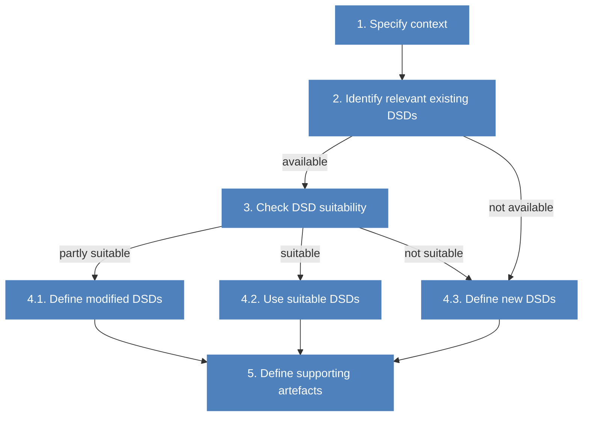
```mermaid
flowchart TB
    S1["1. Specify context"]:::step
    S2["2. Identify relevant existing DSDs"]:::step
    S3["3. Check DSD suitability"]:::step
    S41["4.1. Define modified DSDs"]:::step
    S42["4.2. Use suitable DSDs"]:::step
    S43["4.3. Define new DSDs"]:::step
    S5["5. Define supporting artefacts"]:::step

    S1 --> S2
    S2 -- "available" --> S3
    S2 -- "not available" --> S43
    S3 -- "partly suitable" --> S41
    S3 -- "suitable" --> S42
    S3 -- "not suitable" --> S43
    S41 --> S5
    S42 --> S5
    S43 --> S5

    classDef step fill:#4F81BD,stroke:#4F81BD,color:#FFFFFF
    classDef cat fill:#FFFFFF,stroke:#4F81BD,stroke-width:2px,color:#000000
```

Original figure

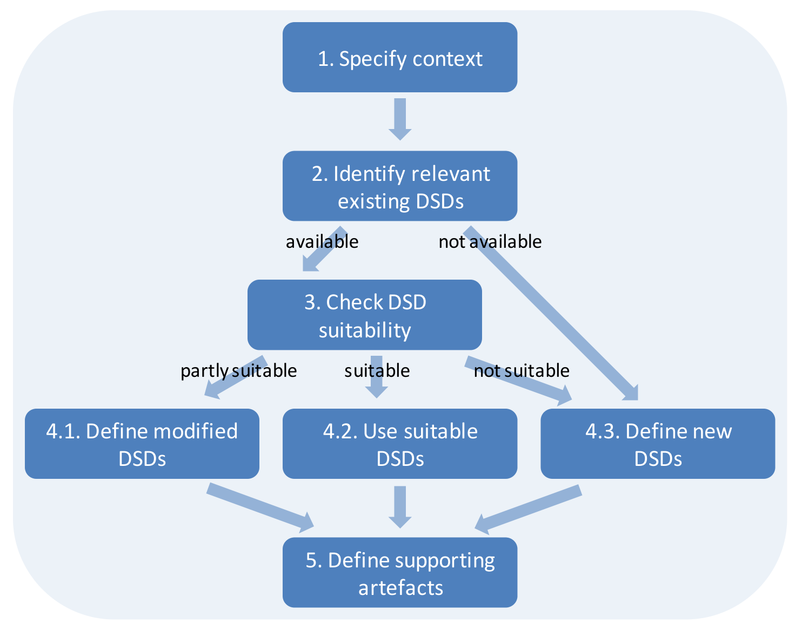

**Figure 1. Overview of the DSD design process**

Figure 2 summarizes the characteristics of the data exchange context that is defined in step 1. These characteristics affect the decision on the data structuring approach that is part of the process of defining the concepts of a new DSD (step 4.3. in Figure 1; see Figure 7 in section 2.).

<!-- figure: f02-exchange-context -->
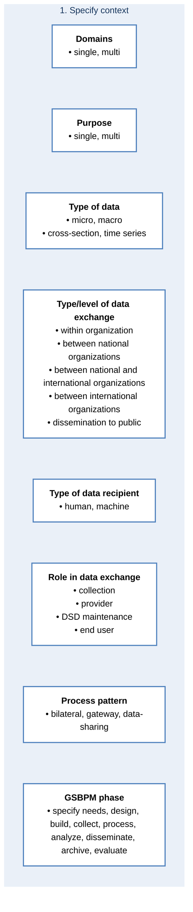
```mermaid
flowchart TB
    subgraph T["1. Specify context"]
        direction TB
        C1["<b>Domains</b><br>• single, multi"]:::cat
        C2["<b>Purpose</b><br>• single, multi"]:::cat
        C3["<b>Type of data</b><br>• micro, macro<br>• cross-section, time series"]:::cat
        C4["<b>Type/level of data exchange</b><br>• within organization<br>• between national organizations<br>• between national and international organizations<br>• between international organizations<br>• dissemination to public"]:::cat
        C5["<b>Type of data recipient</b><br>• human, machine"]:::cat
        C6["<b>Role in data exchange</b><br>• collection<br>• provider<br>• DSD maintenance<br>• end user"]:::cat
        C7["<b>Process pattern</b><br>• bilateral, gateway, data-sharing"]:::cat
        C8["<b>GSBPM phase</b><br>• specify needs, design, build, collect, process, analyze, disseminate, archive, evaluate"]:::cat
        C1 ~~~ C2 ~~~ C3 ~~~ C4 ~~~ C5 ~~~ C6 ~~~ C7 ~~~ C8
    end

    classDef step fill:#4F81BD,stroke:#4F81BD,color:#FFFFFF
    classDef cat fill:#FFFFFF,stroke:#4F81BD,stroke-width:2px,color:#000000
    style T fill:#EAF0F8,stroke:#EAF0F8,color:#17365D
```

Original figure

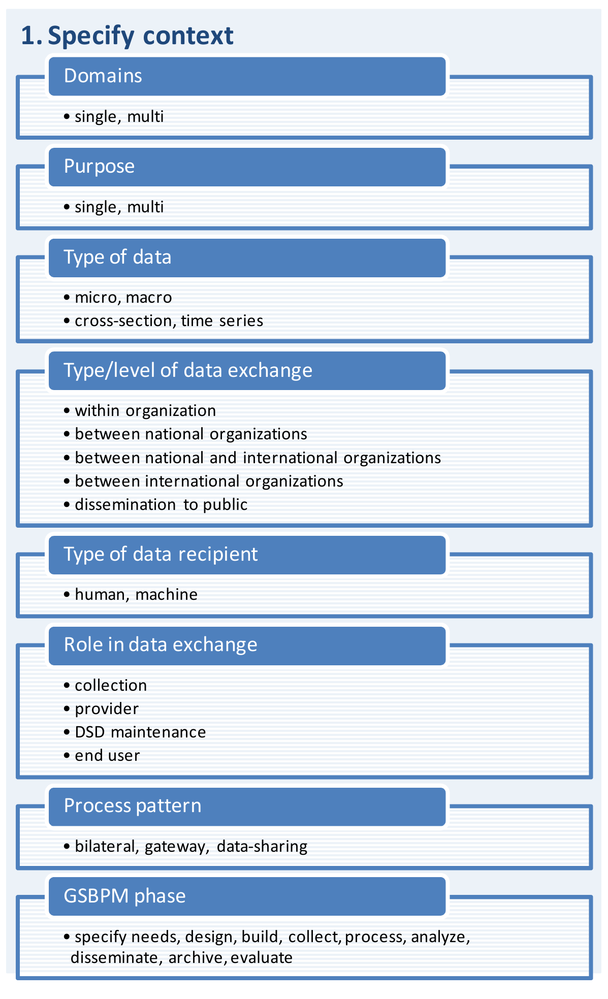

**Figure 2. Characteristics of data exchange context**

Figure 3 recaps the priorities given to different types of existing DSDs when searching for candidates for reuse in step 2. Global DSDs maintained by the SDMX consortium are ranked the highest. They can be found via the Global SDMX Registry.

<!-- figure: f03-priority-ranking-dsds -->
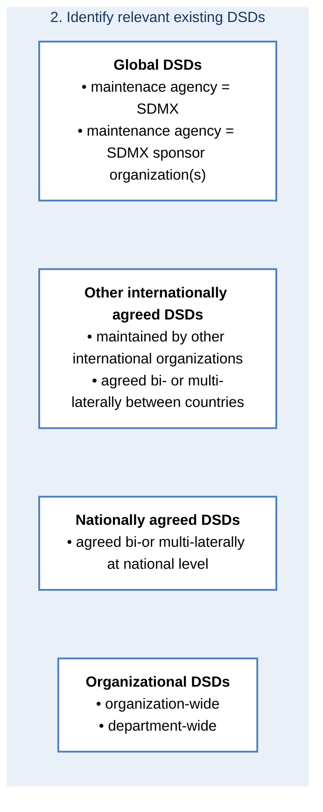
```mermaid
flowchart TB
    subgraph T["2. Identify relevant existing DSDs"]
        direction TB
        C1["<b>Global DSDs</b><br>• maintenace agency = SDMX<br>• maintenance agency = SDMX sponsor organization(s)"]:::cat
        C2["<b>Other internationally agreed DSDs</b><br>• maintained by other international organizations<br>• agreed bi- or multi-laterally between countries"]:::cat
        C3["<b>Nationally agreed DSDs</b><br>• agreed bi-or multi-laterally at national level"]:::cat
        C4["<b>Organizational DSDs</b><br>• organization-wide<br>• department-wide"]:::cat
        C1 ~~~ C2 ~~~ C3 ~~~ C4
    end

    classDef step fill:#4F81BD,stroke:#4F81BD,color:#FFFFFF
    classDef cat fill:#FFFFFF,stroke:#4F81BD,stroke-width:2px,color:#000000
    style T fill:#EAF0F8,stroke:#EAF0F8,color:#17365D
```

Original figure

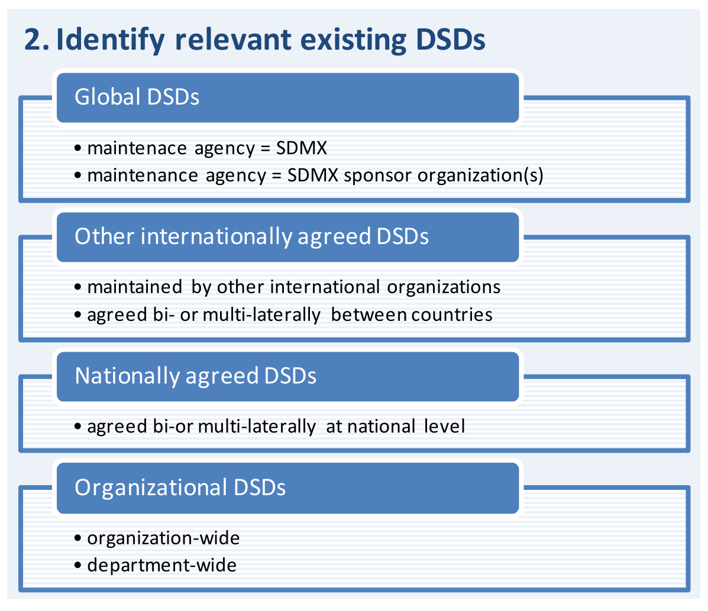

**Figure 3. Priority ranking of existing DSDs for reuse**

Figure 4 summarizes the aspects to be considered in the assessment of the suitability of existing DSDs in step 3. For a detailed description of the cases of partial unsuitability see section 2.1. above.

<!-- figure: f04-dsd-suitability -->
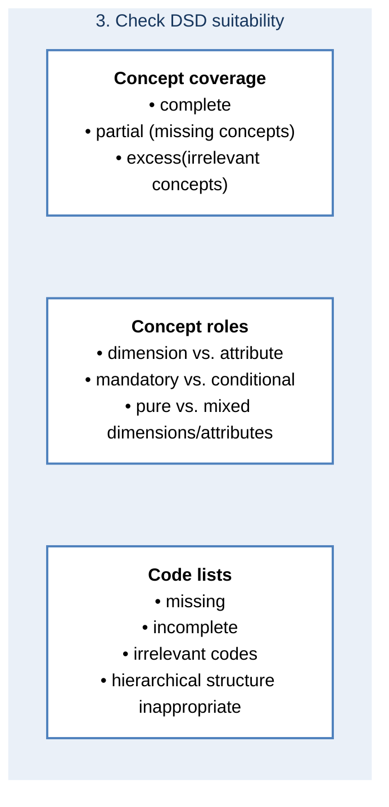
```mermaid
flowchart TB
    subgraph T["3. Check DSD suitability"]
        direction TB
        C1["<b>Concept coverage</b><br>• complete<br>• partial (missing concepts)<br>• excess(irrelevant concepts)"]:::cat
        C2["<b>Concept roles</b><br>• dimension vs. attribute<br>• mandatory vs. conditional<br>• pure vs. mixed dimensions/attributes"]:::cat
        C3["<b>Code lists</b><br>• missing<br>• incomplete<br>• irrelevant codes<br>• hierarchical structure inappropriate"]:::cat
        C1 ~~~ C2 ~~~ C3
    end

    classDef step fill:#4F81BD,stroke:#4F81BD,color:#FFFFFF
    classDef cat fill:#FFFFFF,stroke:#4F81BD,stroke-width:2px,color:#000000
    style T fill:#EAF0F8,stroke:#EAF0F8,color:#17365D
```

Original figure

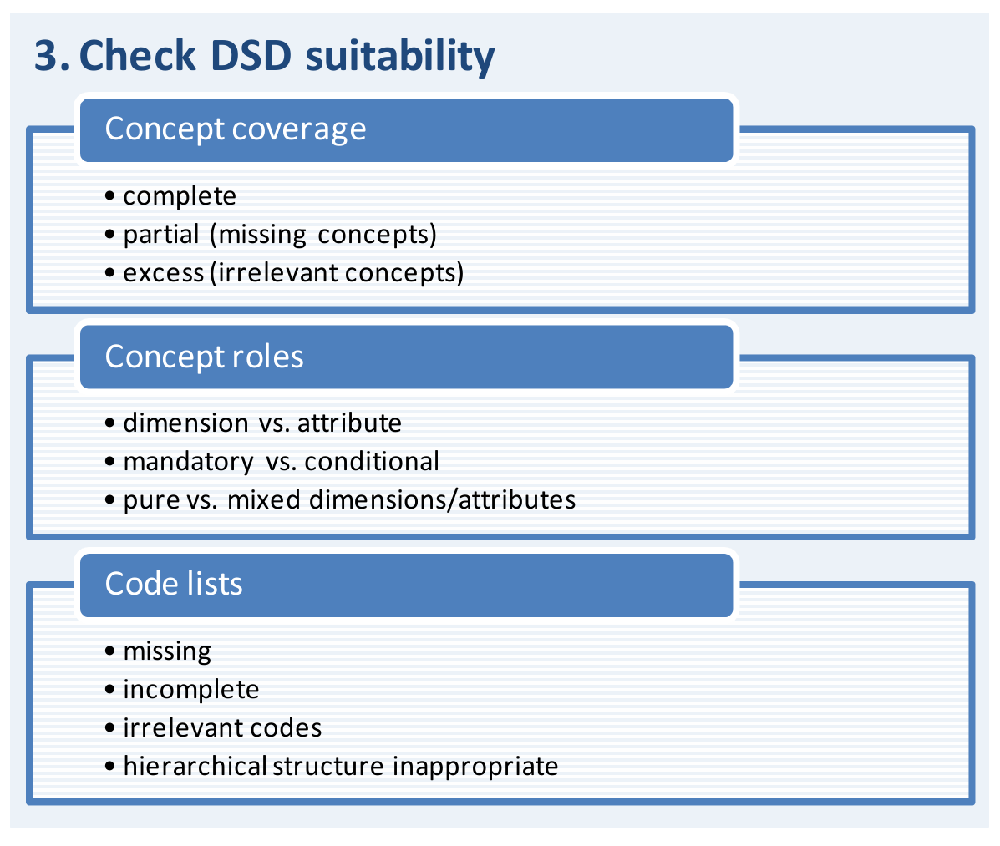

**Figure 4. Aspects of DSD suitability**

Figure 5 lists the most relevant artefacts required in addition to a DSD, its concept scheme, and code lists.

<!-- figure: f05-supporting-artefacts -->
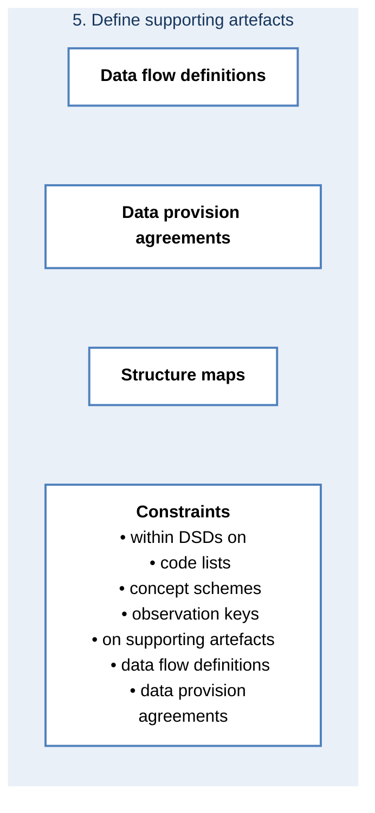
```mermaid
flowchart TB
    subgraph T["5. Define supporting artefacts"]
        direction TB
        C1["<b>Data flow definitions</b>"]:::cat
        C2["<b>Data provision agreements</b>"]:::cat
        C3["<b>Structure maps</b>"]:::cat
        C4["<b>Constraints</b><br>• within DSDs on<br>&nbsp;&nbsp;&nbsp;• code lists<br>&nbsp;&nbsp;&nbsp;• concept schemes<br>&nbsp;&nbsp;&nbsp;• observation keys<br>• on supporting artefacts<br>&nbsp;&nbsp;&nbsp;• data flow definitions<br>&nbsp;&nbsp;&nbsp;• data provision agreements"]:::cat
        C1 ~~~ C2 ~~~ C3 ~~~ C4
    end

    classDef step fill:#4F81BD,stroke:#4F81BD,color:#FFFFFF
    classDef cat fill:#FFFFFF,stroke:#4F81BD,stroke-width:2px,color:#000000
    style T fill:#EAF0F8,stroke:#EAF0F8,color:#17365D
```

Original figure

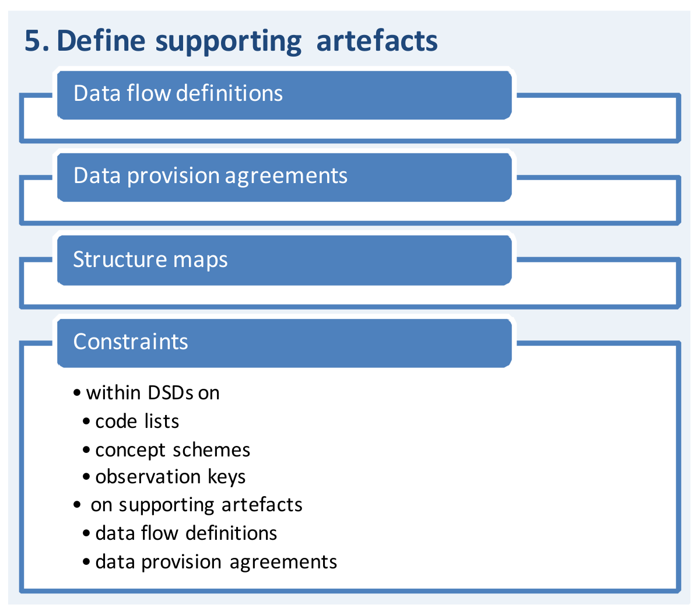

**Figure 5. Supporting artefacts**

## 6.2 Defining modified DSDs

Figure 6 briefly recapitulates the actions that can be taken to overcome partial unsuitability of DSDs. As far as possible, existing artefacts should be reused in this case. This means that even if a DSD cannot be reused as a whole, concepts and code lists from that DSD can be included in the new DSD by reference.

<!-- figure: f06-modification-scenarios -->
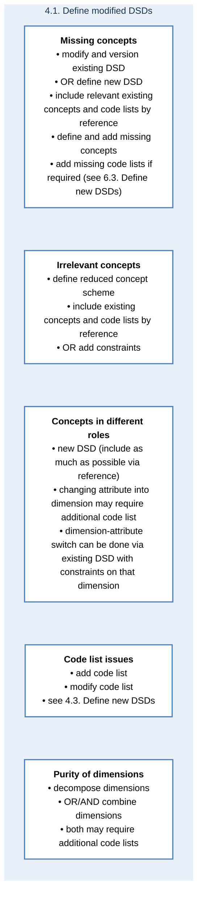
```mermaid
flowchart TB
    subgraph T["4.1. Define modified DSDs"]
        direction TB
        C1["<b>Missing concepts</b><br>• modify and version existing DSD<br>• OR define new DSD<br>&nbsp;&nbsp;&nbsp;• include relevant existing concepts and code lists by reference<br>&nbsp;&nbsp;&nbsp;• define and add missing concepts<br>&nbsp;&nbsp;&nbsp;• add missing code lists if required (see 6.3. Define new DSDs)"]:::cat
        C2["<b>Irrelevant concepts</b><br>• define reduced concept scheme<br>&nbsp;&nbsp;&nbsp;• include existing concepts and code lists by reference<br>• OR add constraints"]:::cat
        C3["<b>Concepts in different roles</b><br>• new DSD (include as much as possible via reference)<br>&nbsp;&nbsp;&nbsp;• changing attribute into dimension may require additional code list<br>&nbsp;&nbsp;&nbsp;• dimension-attribute switch can be done via existing DSD with constraints on that dimension"]:::cat
        C4["<b>Code list issues</b><br>• add code list<br>• modify code list<br>• see 4.3. Define new DSDs"]:::cat
        C5["<b>Purity of dimensions</b><br>• decompose dimensions<br>• OR/AND combine dimensions<br>• both may require additional code lists"]:::cat
        C1 ~~~ C2 ~~~ C3 ~~~ C4 ~~~ C5
    end

    classDef step fill:#4F81BD,stroke:#4F81BD,color:#FFFFFF
    classDef cat fill:#FFFFFF,stroke:#4F81BD,stroke-width:2px,color:#000000
    style T fill:#EAF0F8,stroke:#EAF0F8,color:#17365D
```

Original figure

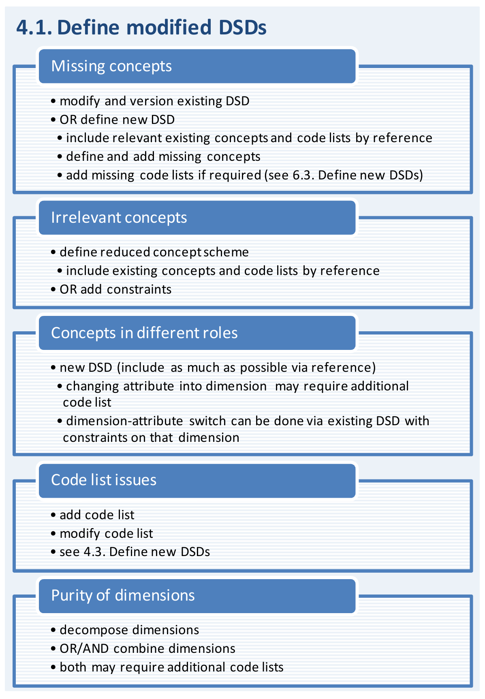

**Figure 6. DSD modification scenarios**

## 6.3 Defining new DSDs

In case no (suitable) DSD is available, the actual process of specifying a new DSD is started. Figure 7 depicts this process (step 4.3. in Figure 1). It encompasses the specification of concepts, code lists, and data formats. All three specification steps include the identification of already existing artefacts that could be reused or modified to satisfy the requirements at hand and the definition of new artefacts in case no suitable artefacts are detected. Several iterations of steps 1 (specification of concepts; see Figure 8) and 2 (specification of code lists; see Figure°13) may be necessary, including revisions of the decision concerning the data structuring approach. Finally all artefacts defined in the previous steps are put together into a DSD.

<!-- figure: f07-new-dsd-process -->
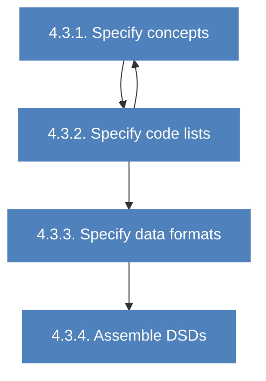
```mermaid
flowchart TB
    A["4.3.1. Specify concepts"]:::step
    B["4.3.2. Specify code lists"]:::step
    C["4.3.3. Specify data formats"]:::step
    D["4.3.4. Assemble DSDs"]:::step
    A --> B --> C --> D
    B --> A

    classDef step fill:#4F81BD,stroke:#4F81BD,color:#FFFFFF
    classDef cat fill:#FFFFFF,stroke:#4F81BD,stroke-width:2px,color:#000000
```

Original figure

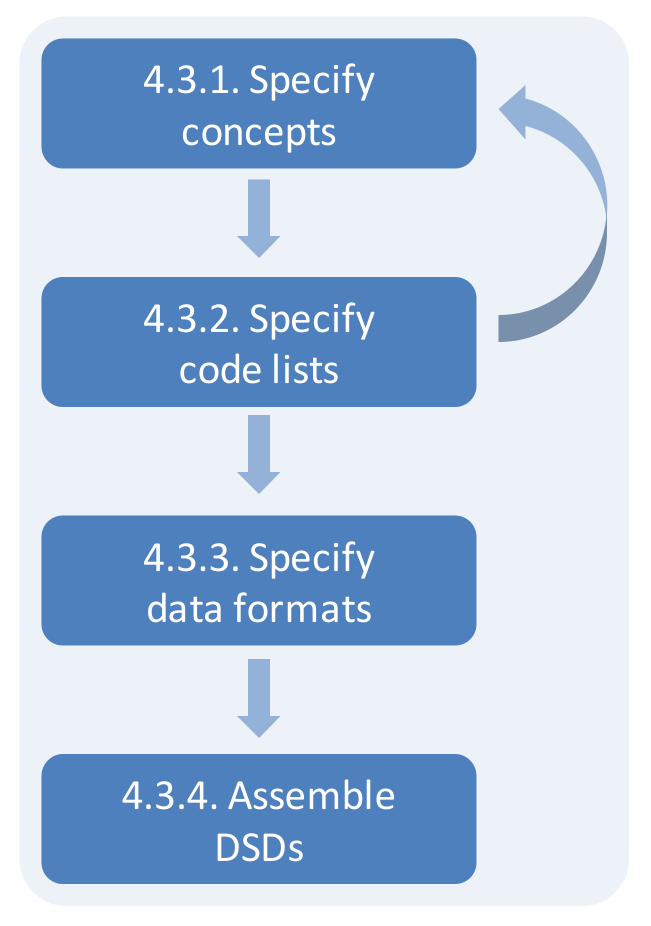

**Figure 7. New DSD specification process**

Figure 8 outlines step 4.3.1, the process of concept specification. It covers the decision on the structuring approach, the identification of relevant concepts and the assessment of their suitability, the definition of new concepts, concept roles, and attribute attachment levels.

<!-- figure: f08-concept-process -->
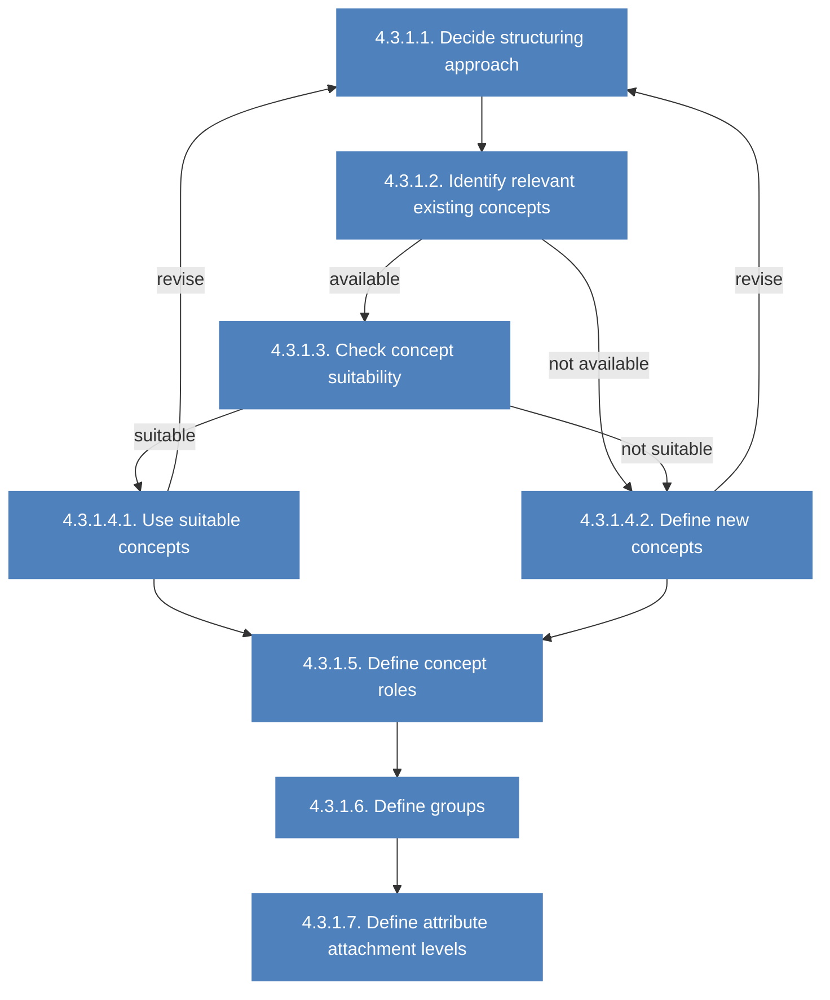
```mermaid
flowchart TB
    A["4.3.1.1. Decide structuring approach"]:::step
    B["4.3.1.2. Identify relevant existing concepts"]:::step
    C["4.3.1.3. Check concept suitability"]:::step
    D1["4.3.1.4.1. Use suitable concepts"]:::step
    D2["4.3.1.4.2. Define new concepts"]:::step
    E["4.3.1.5. Define concept roles"]:::step
    F["4.3.1.6. Define groups"]:::step
    G["4.3.1.7. Define attribute attachment levels"]:::step

    A --> B
    B -- "available" --> C
    B -- "not available" --> D2
    C -- "suitable" --> D1
    C -- "not suitable" --> D2
    D1 --> E
    D2 --> E
    E --> F --> G
    D1 -- "revise" --> A
    D2 -- "revise" --> A

    classDef step fill:#4F81BD,stroke:#4F81BD,color:#FFFFFF
    classDef cat fill:#FFFFFF,stroke:#4F81BD,stroke-width:2px,color:#000000
```

Original figure

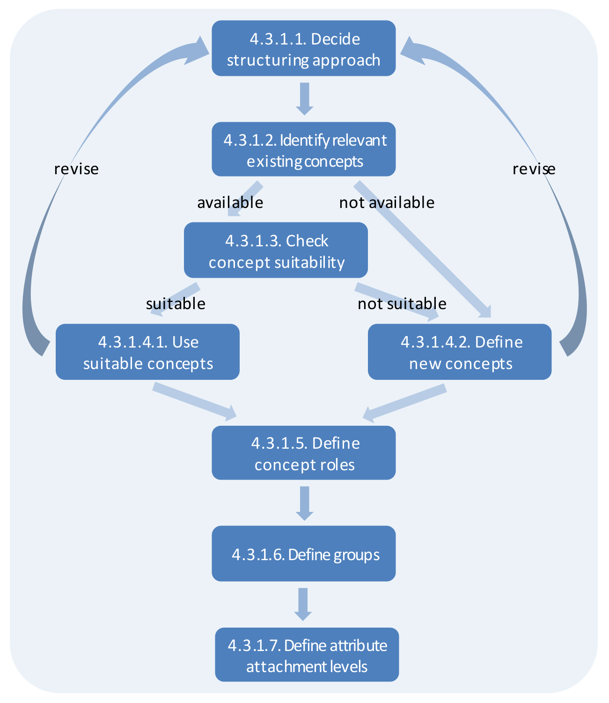

**Figure 8. Concept specification process**

Both, the decision on reuse of existing concepts as well as the definition of new ones, may lead back to a revision of the data structuring approach. For example, it could turn out that a certain concept needs to be broken down further which may lead from a “few composite dimensions” to a “many pure dimensions” approach. Figure 9 provides the design options involved in the decision on a data structuring approach. The options are defined in terms of the number of DSDs and the number of concepts (especially dimensions). The reasonability and feasibility of these options depend on the context of the present data exchange(s) as defined in the first step of the overall design process and on the content of the data exchange with respect to concepts.

<!-- figure: f09-design-options -->
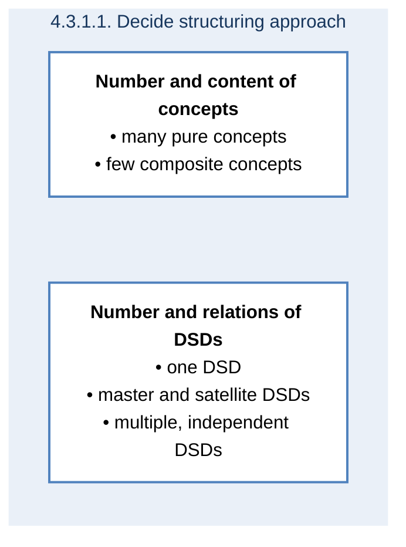
```mermaid
flowchart TB
    subgraph T["4.3.1.1. Decide structuring approach"]
        direction TB
        C1["<b>Number and content of concepts</b><br>• many pure concepts<br>• few composite concepts"]:::cat
        C2["<b>Number and relations of DSDs</b><br>• one DSD<br>• master and satellite DSDs<br>• multiple, independent DSDs"]:::cat
        C1 ~~~ C2
    end

    classDef step fill:#4F81BD,stroke:#4F81BD,color:#FFFFFF
    classDef cat fill:#FFFFFF,stroke:#4F81BD,stroke-width:2px,color:#000000
    style T fill:#EAF0F8,stroke:#EAF0F8,color:#17365D
```

Original figure

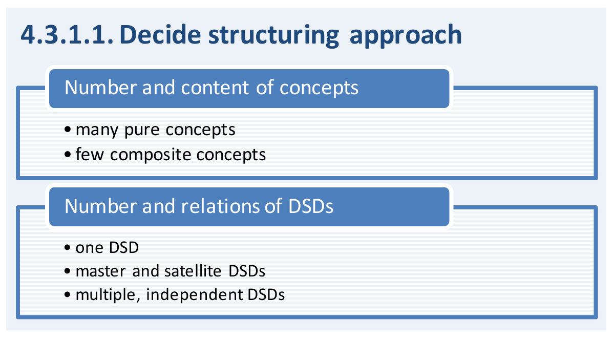

**Figure 9. DSD design options**

In the second step of new DSD design, relevant existing concepts are identified. Figure 10 indicates potential sources of those concepts such as the SDMX COG for cross-domain concepts, global or other DSDs as already identified earlier in the process, and domain standards such as the UN's System of National Accounts Manual 2008 for domain-specific concepts.

<!-- figure: f10-concept-sources -->
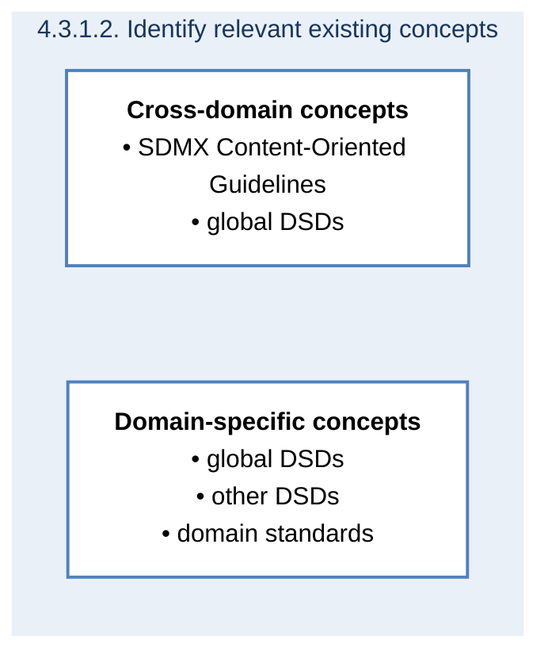
```mermaid
flowchart TB
    subgraph T["4.3.1.2. Identify relevant existing concepts"]
        direction TB
        C1["<b>Cross-domain concepts</b><br>• SDMX Content-Oriented Guidelines<br>• global DSDs"]:::cat
        C2["<b>Domain-specific concepts</b><br>• global DSDs<br>• other DSDs<br>• domain standards"]:::cat
        C1 ~~~ C2
    end

    classDef step fill:#4F81BD,stroke:#4F81BD,color:#FFFFFF
    classDef cat fill:#FFFFFF,stroke:#4F81BD,stroke-width:2px,color:#000000
    style T fill:#EAF0F8,stroke:#EAF0F8,color:#17365D
```

Original figure

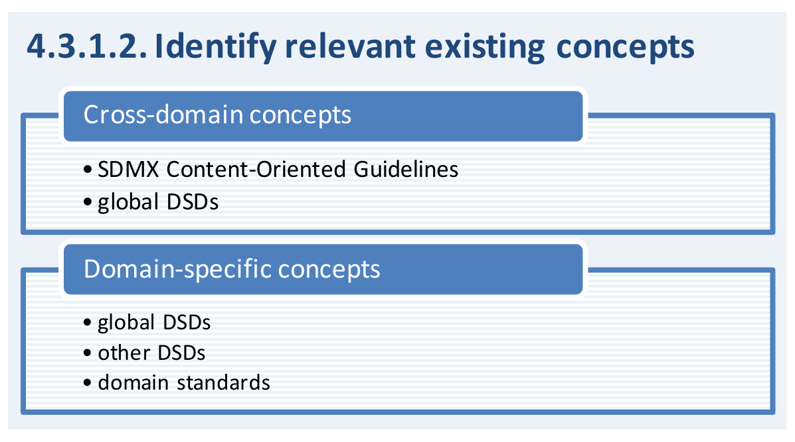

**Figure 10. Potential sources of concepts and definitions**

The definition of new concepts (step 4.3.1.4.2.) is necessary if no (suitable) concept can be reused. It entails giving each concept a name, a code, and a definition. Further details about the usage of the concepts in the DSD are specified in steps 4.3.1.5. (concept roles), 4.3.1.6. (dimension groups), and 4.3.1.7. (attribute attachment levels). Figure 11 and 12 summarize the possible concept roles and attribute attachment levels.

<!-- figure: f11-concept-roles -->
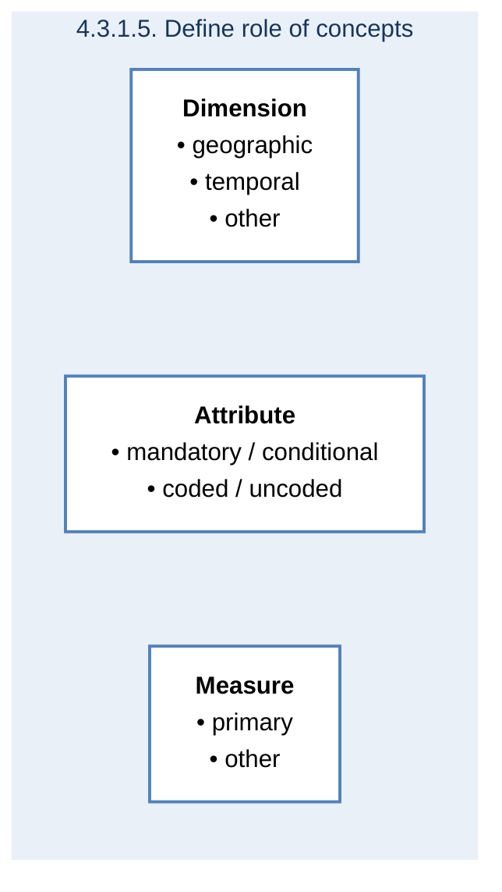
```mermaid
flowchart TB
    subgraph T["4.3.1.5. Define role of concepts"]
        direction TB
        C1["<b>Dimension</b><br>• geographic<br>• temporal<br>• other"]:::cat
        C2["<b>Attribute</b><br>• mandatory / conditional<br>• coded / uncoded"]:::cat
        C3["<b>Measure</b><br>• primary<br>• other"]:::cat
        C1 ~~~ C2 ~~~ C3
    end

    classDef step fill:#4F81BD,stroke:#4F81BD,color:#FFFFFF
    classDef cat fill:#FFFFFF,stroke:#4F81BD,stroke-width:2px,color:#000000
    style T fill:#EAF0F8,stroke:#EAF0F8,color:#17365D
```

Original figure

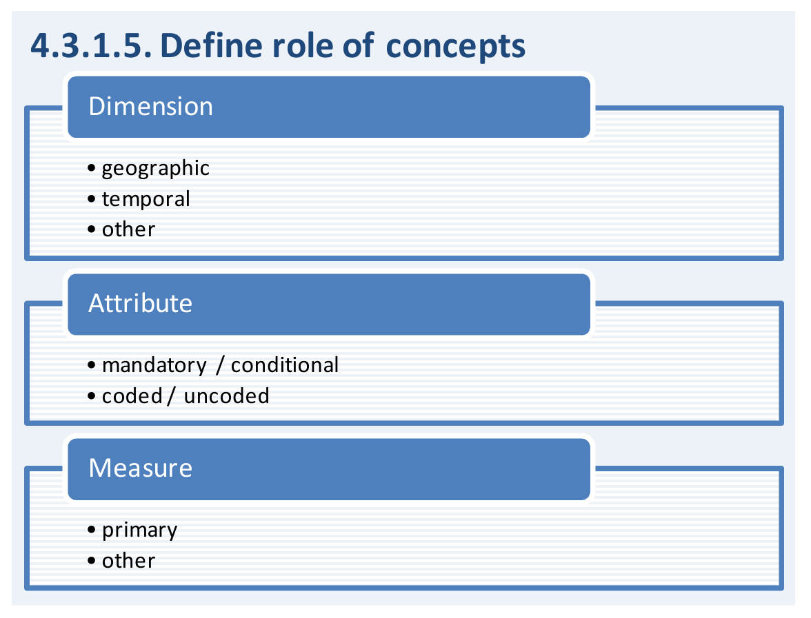

**Figure 11. Possible concept roles**

<!-- figure: f12-attachment-levels -->
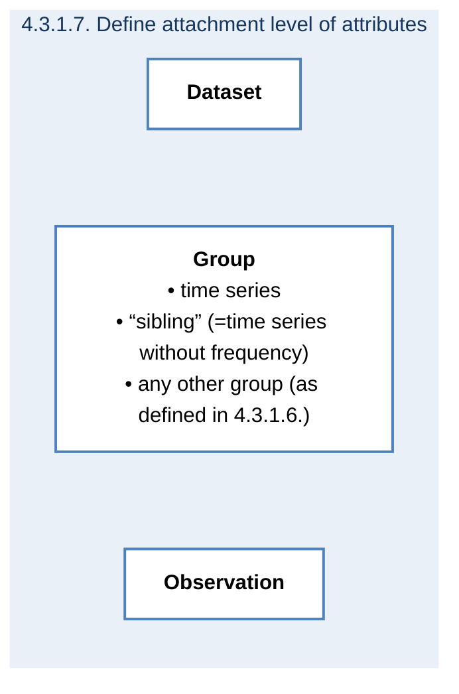
```mermaid
flowchart TB
    subgraph T["4.3.1.7. Define attachment level of attributes"]
        direction TB
        C1["<b>Dataset</b>"]:::cat
        C2["<b>Group</b><br>• time series<br>• “sibling” (=time series without frequency)<br>• any other group (as defined in 4.3.1.6.)"]:::cat
        C3["<b>Observation</b>"]:::cat
        C1 ~~~ C2 ~~~ C3
    end

    classDef step fill:#4F81BD,stroke:#4F81BD,color:#FFFFFF
    classDef cat fill:#FFFFFF,stroke:#4F81BD,stroke-width:2px,color:#000000
    style T fill:#EAF0F8,stroke:#EAF0F8,color:#17365D
```

Original figure

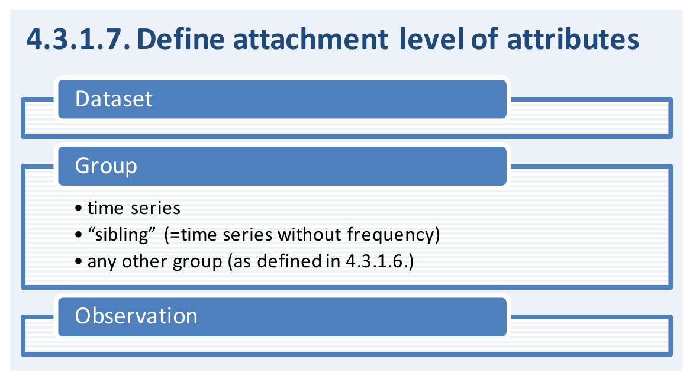

**Figure 12. Possible attribute attachment levels**

The second step in the process of defining a new DSD is the specification of code lists for all coded concepts. All dimensions must be coded (with time being an exception to this rule); attributes may be coded. For uncoded concepts, a data format has to be specified. Existing formats may be reused or new ones defined. An example is the time format that is specified in the SDMX COG. Figure 13 illustrates the code list specification process. If no relevant and suitable code list exists, a new one will be defined or a partially suitable one will be adapted (see Figure 16). Suitable code lists can simply be reused via reference.

<!-- figure: f13-codelist-process -->
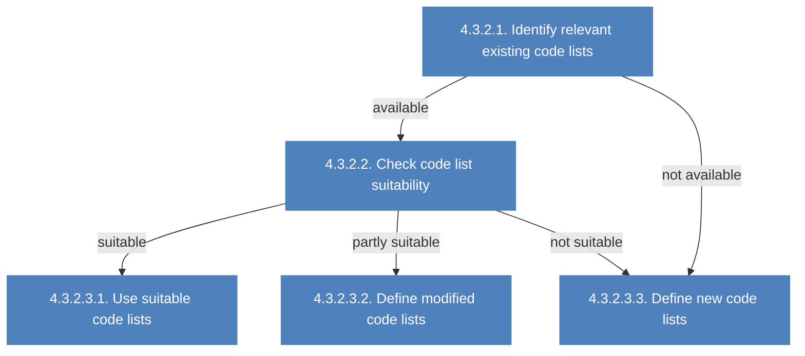
```mermaid
flowchart TB
    A["4.3.2.1. Identify relevant existing code lists"]:::step
    B["4.3.2.2. Check code list suitability"]:::step
    C1["4.3.2.3.1. Use suitable code lists"]:::step
    C2["4.3.2.3.2. Define modified code lists"]:::step
    C3["4.3.2.3.3. Define new code lists"]:::step
    A -- "available" --> B
    A -- "not available" --> C3
    B -- "suitable" --> C1
    B -- "partly suitable" --> C2
    B -- "not suitable" --> C3

    classDef step fill:#4F81BD,stroke:#4F81BD,color:#FFFFFF
    classDef cat fill:#FFFFFF,stroke:#4F81BD,stroke-width:2px,color:#000000
```

Original figure

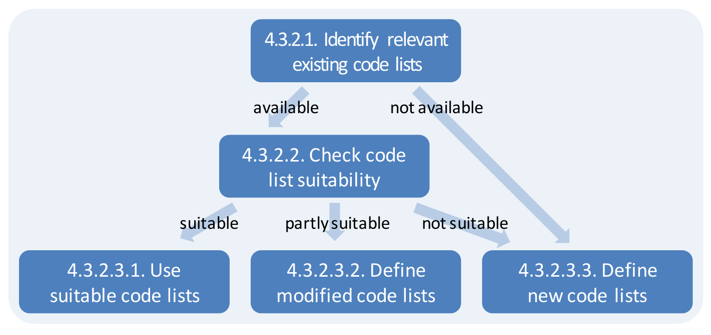

**Figure 13. Code list specification process**

Figure 14 recaps the priorities given to different types of existing code lists when searching for candidates for reuse (step 4.3.2.1.). Code lists recommended by the SDMX COG (and maintained by the SDMX consortium) are ranked the highest.

<!-- figure: f14-priority-ranking-codelists -->
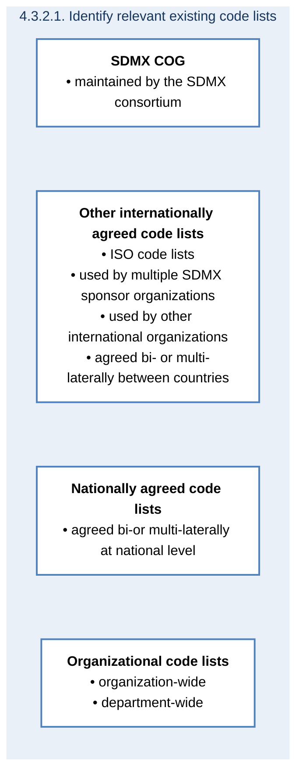
```mermaid
flowchart TB
    subgraph T["4.3.2.1. Identify relevant existing code lists"]
        direction TB
        C1["<b>SDMX COG</b><br>• maintained by the SDMX consortium"]:::cat
        C2["<b>Other internationally agreed code lists</b><br>• ISO code lists<br>• used by multiple SDMX sponsor organizations<br>• used by other international organizations<br>• agreed bi- or multi-laterally between countries"]:::cat
        C3["<b>Nationally agreed code lists</b><br>• agreed bi-or multi-laterally at national level"]:::cat
        C4["<b>Organizational code lists</b><br>• organization-wide<br>• department-wide"]:::cat
        C1 ~~~ C2 ~~~ C3 ~~~ C4
    end

    classDef step fill:#4F81BD,stroke:#4F81BD,color:#FFFFFF
    classDef cat fill:#FFFFFF,stroke:#4F81BD,stroke-width:2px,color:#000000
    style T fill:#EAF0F8,stroke:#EAF0F8,color:#17365D
```

Original figure

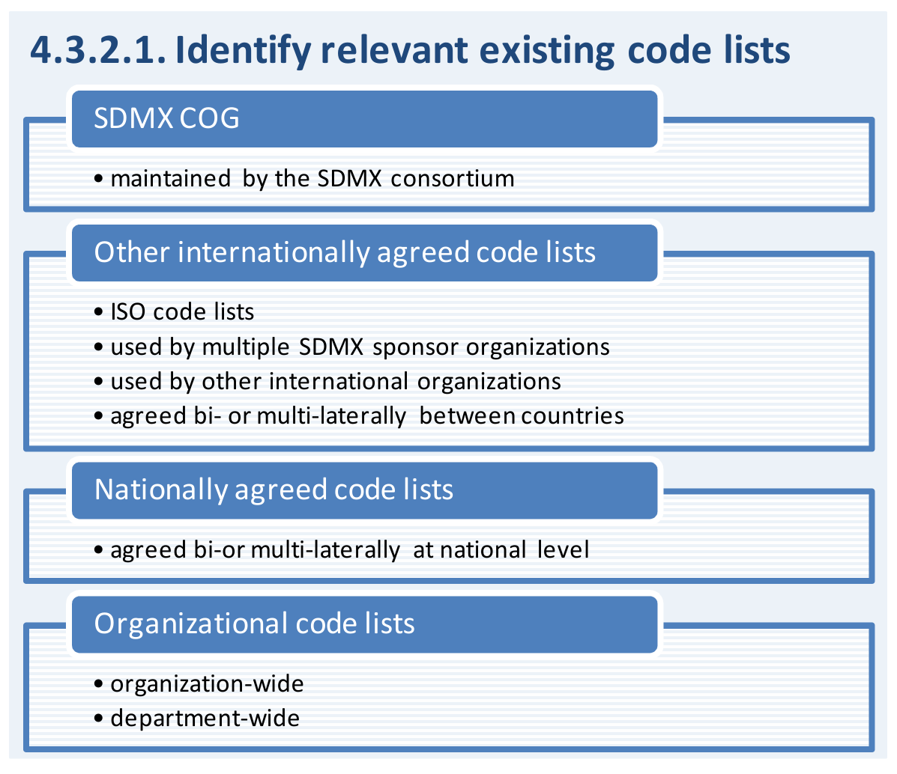

**Figure 14. Priority ranking of existing code lists for reuse**

Figure 15 summarizes the aspects to be considered in the evaluation of the suitability of existing code lists (step 4.3.2.2.). Figure 16 summarizes the scenarios of adapting existing code lists that do not fully meet the specified needs (step 4.3.2.3.2). For a detailed description of the cases of partial unsuitability see section 2.1. above.

<!-- figure: f15-codelist-suitability -->
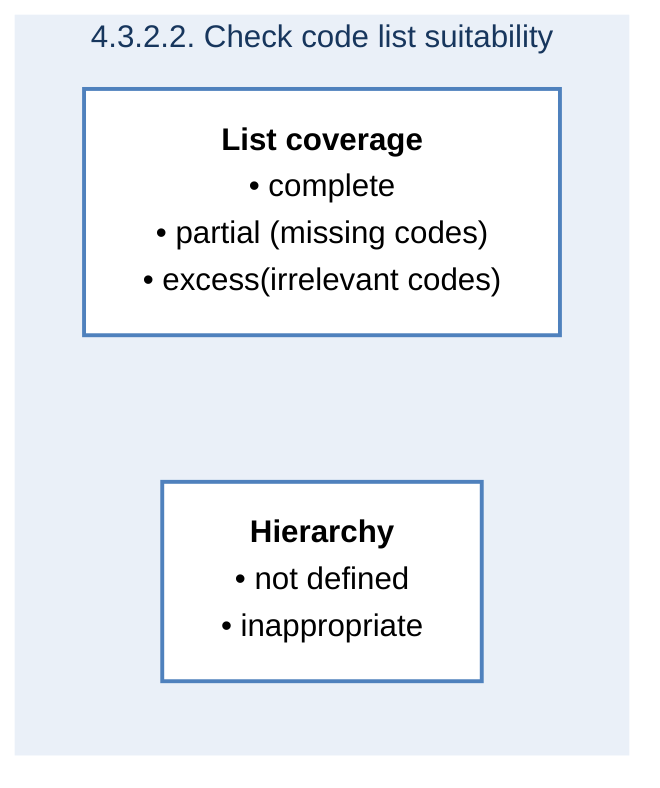
```mermaid
flowchart TB
    subgraph T["4.3.2.2. Check code list suitability"]
        direction TB
        C1["<b>List coverage</b><br>• complete<br>• partial (missing codes)<br>• excess(irrelevant codes)"]:::cat
        C2["<b>Hierarchy</b><br>• not defined<br>• inappropriate"]:::cat
        C1 ~~~ C2
    end

    classDef step fill:#4F81BD,stroke:#4F81BD,color:#FFFFFF
    classDef cat fill:#FFFFFF,stroke:#4F81BD,stroke-width:2px,color:#000000
    style T fill:#EAF0F8,stroke:#EAF0F8,color:#17365D
```

Original figure

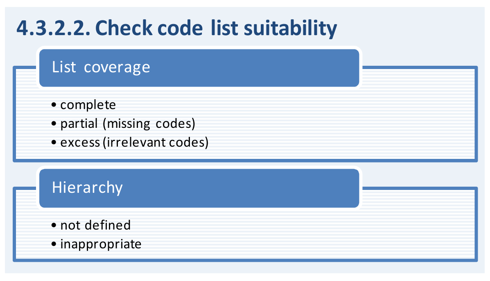

**Figure 15. Aspects of code list suitability**

<!-- figure: f16-codelist-modification -->
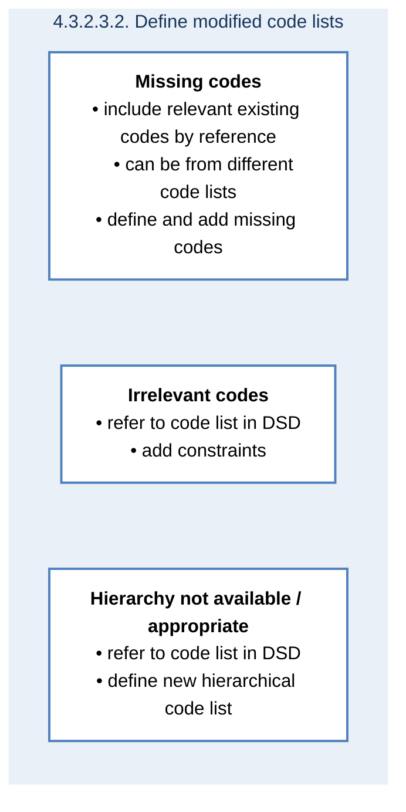
```mermaid
flowchart TB
    subgraph T["4.3.2.3.2. Define modified code lists"]
        direction TB
        C1["<b>Missing codes</b><br>• include relevant existing codes by reference<br>&nbsp;&nbsp;&nbsp;• can be from different code lists<br>• define and add missing codes"]:::cat
        C2["<b>Irrelevant codes</b><br>• refer to code list in DSD<br>• add constraints"]:::cat
        C3["<b>Hierarchy not available / appropriate</b><br>• refer to code list in DSD<br>• define new hierarchical code list"]:::cat
        C1 ~~~ C2 ~~~ C3
    end

    classDef step fill:#4F81BD,stroke:#4F81BD,color:#FFFFFF
    classDef cat fill:#FFFFFF,stroke:#4F81BD,stroke-width:2px,color:#000000
    style T fill:#EAF0F8,stroke:#EAF0F8,color:#17365D
```

Original figure

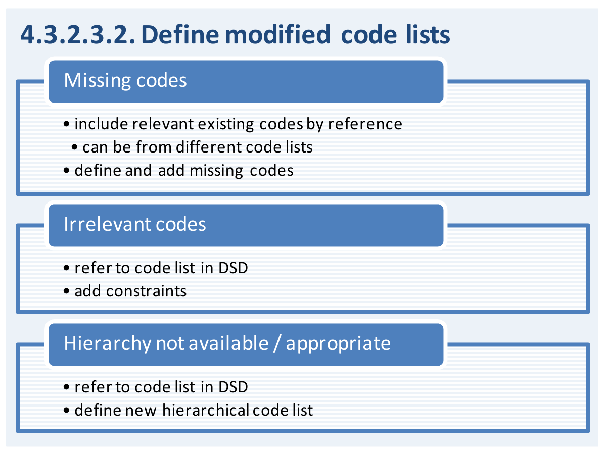

**Figure 16. Code list modification scenarios**

If new code lists need to be defined, please refer to the SDMX Guidelines for the creation of code lists. Basically, code, name, and definition need to be provided for each item in the code list. In addition, hierarchical code lists may be defined.

The final step in defining a new DSD covers the assembly of all components specified during the process, i.e. concept scheme(s), code lists, data formats, concept roles, attribute attachment levels, and the assignment of code lists and data formats to concepts.

## 6.4 Checklist for DSD Designers

Figure 17 provides an overview of all steps in the DSD design process as described in the previous subsections 1. to 3. Figure 18 compiles those steps into a checklist for DSD designers to help them make sure all aspects are considered.

<!-- figure: f17-dsd-design-process -->
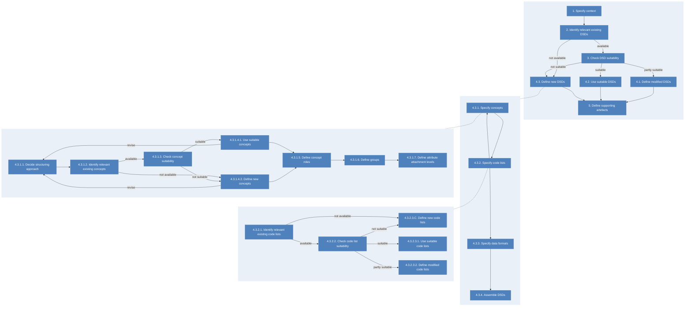
```mermaid
flowchart TB
    subgraph P1[" "]
        direction LR
        S1["1. Specify context"]:::step
        S2["2. Identify relevant existing DSDs"]:::step
        S3["3. Check DSD suitability"]:::step
        S41["4.1. Define modified DSDs"]:::step
        S42["4.2. Use suitable DSDs"]:::step
        S43["4.3. Define new DSDs"]:::step
        S5["5. Define supporting artefacts"]:::step
        S1 --> S2
        S2 -- "available" --> S3
        S2 -- "not available" --> S43
        S3 -- "partly suitable" --> S41
        S3 -- "suitable" --> S42
        S3 -- "not suitable" --> S43
        S41 --> S5
        S42 --> S5
        S43 --> S5
    end
    subgraph P2[" "]
        direction LR
        N1["4.3.1. Specify concepts"]:::step
        N2["4.3.2. Specify code lists"]:::step
        N3["4.3.3. Specify data formats"]:::step
        N4["4.3.4. Assemble DSDs"]:::step
        N1 --> N2 --> N3 --> N4
        N2 --> N1
    end
    subgraph P3[" "]
        direction LR
        A["4.3.1.1. Decide structuring approach"]:::step
        B["4.3.1.2. Identify relevant existing concepts"]:::step
        C["4.3.1.3. Check concept suitability"]:::step
        D1["4.3.1.4.1. Use suitable concepts"]:::step
        D2["4.3.1.4.2. Define new concepts"]:::step
        E["4.3.1.5. Define concept roles"]:::step
        F["4.3.1.6. Define groups"]:::step
        G["4.3.1.7. Define attribute attachment levels"]:::step
        A --> B
        B -- "available" --> C
        B -- "not available" --> D2
        C -- "suitable" --> D1
        C -- "not suitable" --> D2
        D1 --> E
        D2 --> E
        E --> F --> G
        D2 -- "revise" --> A
        D1 -- "revise" --> A
    end
    subgraph P4[" "]
        direction LR
        K1["4.3.2.1. Identify relevant existing code lists"]:::step
        K2["4.3.2.2. Check code list suitability"]:::step
        K31["4.3.2.3.1. Use suitable code lists"]:::step
        K32["4.3.2.3.2. Define modified code lists"]:::step
        K33["4.3.2.3.C. Define new code lists"]:::step
        K1 -- "available" --> K2
        K1 -- "not available" --> K33
        K2 -- "suitable" --> K31
        K2 -- "partly suitable" --> K32
        K2 -- "not suitable" --> K33
    end
    S43 -.- P2
    N1 -.- P3
    N2 -.- P4

    classDef step fill:#4F81BD,stroke:#4F81BD,color:#FFFFFF
    style P1 fill:#EAF0F8,stroke:#EAF0F8
    style P2 fill:#EAF0F8,stroke:#EAF0F8
    style P3 fill:#EAF0F8,stroke:#EAF0F8
    style P4 fill:#EAF0F8,stroke:#EAF0F8
```

Original figure

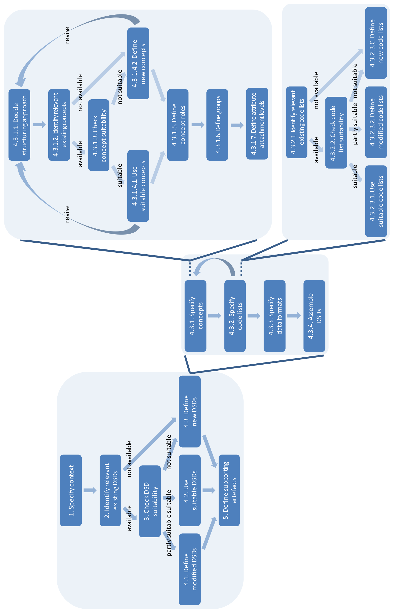

**Figure 17. DSD design process**

<!-- figure: f18-checklist -->
<table>
<tr><td style="background-color:#DBE5F1"><strong>1. Specify context</strong></td></tr>
<tr><td style="background-color:#DBE5F1"><strong>2. Identify relevant existing DSDs</strong></td></tr>
<tr><td style="background-color:#DBE5F1"><strong>3. Check DSD suitability</strong></td></tr>
<tr><td style="background-color:#DBE5F1"><strong>4. 1. If DSDs partly suitable: Define modified DSDs</strong></td></tr>
<tr><td style="background-color:#DBE5F1"><strong>4. 2. If DSDs suitable: Use them</strong></td></tr>
<tr><td style="background-color:#DBE5F1"><strong>4. 3. If DSDs not suitable or not available: Define new DSDs</strong></td></tr>
<tr><td style="background-color:#B8CCE4"><strong>4. 3. 1. Specify concepts</strong></td></tr>
<tr><td style="background-color:#95B3D7">4. 3. 1. 1. Decide DSD structuring approach</td></tr>
<tr><td style="background-color:#95B3D7">4. 3. 1. 2. Identify relevant existing concepts</td></tr>
<tr><td style="background-color:#95B3D7">4. 3. 1. 3. Check concept suitability</td></tr>
<tr><td style="background-color:#95B3D7">4. 3. 1. 4. 1. If suitable: Use concepts</td></tr>
<tr><td style="background-color:#95B3D7">4. 3. 1. 4. 2. If not suitable or not available: Define new concepts</td></tr>
<tr><td style="background-color:#95B3D7">4. 3. 1. 5. Define concept roles</td></tr>
<tr><td style="background-color:#95B3D7">4. 3. 1. 6. Define groups</td></tr>
<tr><td style="background-color:#95B3D7">4. 3. 1. 7. Define attribute attachment levels</td></tr>
<tr><td style="background-color:#B8CCE4"><strong>4. 3. 2. Specify code lists</strong></td></tr>
<tr><td style="background-color:#95B3D7">4. 3. 2. 1. Identify relevant existing code lists</td></tr>
<tr><td style="background-color:#95B3D7">4. 3. 2. 2. Check code list suitability</td></tr>
<tr><td style="background-color:#95B3D7">4. 3. 2. 3. 1. If suitable: Use code lists</td></tr>
<tr><td style="background-color:#95B3D7">4. 3. 2. 3. 2. If partly suitable: Define modified code lists</td></tr>
<tr><td style="background-color:#95B3D7">4. 3. 2. 3. 3. If not suitable or not available: Define new code lists</td></tr>
<tr><td style="background-color:#B8CCE4"><strong>4. 3. 3. Specify data formats</strong></td></tr>
<tr><td style="background-color:#B8CCE4"><strong>4. 3. 4. Assemble DSDs</strong></td></tr>
<tr><td style="background-color:#DBE5F1"><strong>5. Define supporting artefacts</strong></td></tr>
</table>

Original figure

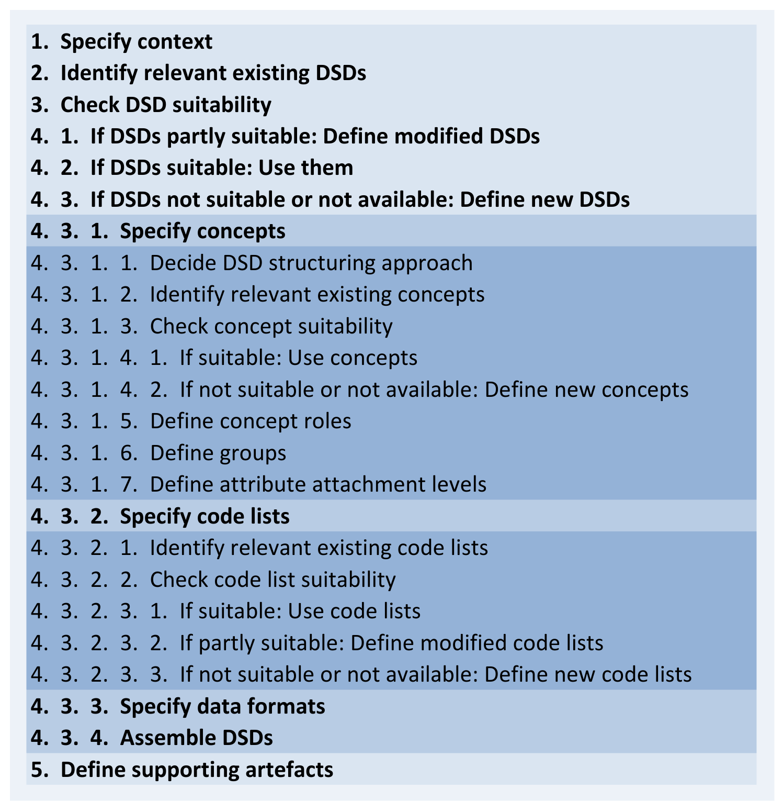

**Figure 18. Checklist for DSD design process**

# 7 ANNEX 1. GLOSSARY OF TERMS

#### This glossary was removed in February 2014 because the system of SDMX glossaries is being reviewed with the purpose of producing one centralised glossary encompassing the whole SDMX terminology.

# 8 ANNEX 2. WHAT IS A DSD?

*Data* and *metadata structure definitions* (DSDs & MSDs, respectively) associate *statistical concepts* with their value domains and assign concept roles. Concepts are defined in a *concept scheme*; value domains are specified as a *code list* or by a *data type/format*. For example, the domain of a concept with a categorical representation such as “industrial sector” is specified by a code list that provides the values for the “industrial sector”. *Hierarchical code lists* can be used to specify parent-child relationships between (a subset of) the codes of a (flat) code list. For concepts without categorical representation, for instance “reference period”, the value domain can be defined by specifying a time format, a numeric data type, or a text format. Such a format determines the structure of the admissible values instead of explicitly enumerating them. Concept schemes and code lists do not have to be defined together with a DSD; they are usually included by reference.

Concepts assume different roles in a data structure definition:

- *dimensions* are required to uniquely identify an observation (a data value); e.g., for time series, at least one geographic, one temporal, and one (“mixed") subject-matter dimension are required to identify a data value (for instance: reference area = Mexico, time = 2002, indicator = GDP nominal, US$)<a href="#fn-6" id="fnref-6">6</a>;
- *measures* are the containers of the actual observation or data values;
- *attributes* provide additional meta-information required to interpret the data correctly but not to identify the observations; for instance, data for the same observation defined by a value combination of the dimensions (also termed “key”) will usually only be provided for one unit multiplier, e.g. in millions; hence unit multiplier is not necessary to identify an observation, but it is still required for a proper interpretation. Attributes can be defined as mandatory or not mandatory, and they can be attached at different levels, e.g. at observation level or at the level of groups defined by the value combinations of a predefined subset of dimensions (for example reporting currency may be attached at the country level).

Data are exchanged according to a *data flow definition*. A data flow definition identifies the DSD that defines the structure of the data exchanged, may be associated with a subject-matter domain, and may contain *constraints* that further restrict the admissible keys and thus the coverage of the data flow. A data provider may provide data for multiple data flows and multiple data providers may contribute to one and the same data flow. *Provision agreements* specify which data providers supply what data to which data flows. The agreements may contain a reporting or publishing calendar, *constraints* on the code lists and/or keys to define what subset of the data flow is contributed, and the temporal coverage of the data provided. For example, constraints may restrict the reference area dimension to a specific subset that is provided by a certain data provider. The actual source of data is also stated in a provision agreement in terms of a URL.

To briefly summarize the above: A DSD requires a concept scheme and code lists that can be assigned to concepts. It defines the roles of the concepts and the value domains of the dimensions, attributes, and measures. It can use constraints to restrict the admissible set of codes from the referenced code list(s) or the admissible observation keys. It is used in the definition of a data flow and plays a major role in data exchange by providing a “shared language”. A data flow definition may also use constraints to further restrict the data that may be exchanged in that data flow. A data provision agreement defines who (= data provider) provides what (= part of data flow defined by constraints on the DSD) to a data flow. For more details on SDMX artefacts see Section 2 of the SDMX Standards.

# 9 ANNEX 3. REFERENCES

## 9.1 SDMX Documents

The SDMX documents referred to in these guidelines as well as the complete technical specification of the SDMX Technical Standard 2.1 (and earlier versions) are available online at http://sdmx.org/. The SDMX documents currently under development by the Statistical and Technical Working Groups will also be made available on the SDMX website.

### 9.1.1 Existing documents

SDMX Content-Oriented Guidelines 2009 (5 Annexes).

SDMX Standards: Section 2 - Information Model: UML Conceptual Design.

SDMX Standards: Part 5 - SDMX Registry Specification: Logical Functionality and Logical Interfaces.

SDMX Standards: Section 6 - Technical Notes Version 2.1.

### 9.1.2 Not yet available documents

Business Requirements and Use-Cases for the SDMX Global Registry.

SDMX Guidelines for the Creation and Maintenance of Code Lists.

SDMX Guidelines for the Governance and Maintenance of Artefacts.

SDMX Guidelines for the Design of MSDs.

## 9.2 Non-SDMX Documents

6th Edition of the IMF's Balance of Payments Manual (BPM6). Available online at

http://www.imf.org/external/pubs/ft/bop/2007/bopman6.htm.

METIS: Generic Statistical Business Process Model (GSBPM). Available online at

http://www1.unece.org/stat/platform/display/metis/The+Generic+Statistical+Business+Process+Model.

UN's System of National Accounts Manual 2008 (SNA2008). Available online at

http://unstats.un.org/unsd/nationalaccount/sna2008.asp.

<!-- footnotes -->

---

1 Technically speaking, a third possibility exists. A structure map can be used to define the reduced DSD. The structure map establishes a mapping between a source structure and a target structure. In this special case, the aim of the structure map is simply to get rid of irrelevant dimensions. To this end the DSD is mapped to itself, and any unmapped dimensions will not be part of the target structure. The original DSD is not affected by the structure map. The reduced DSD can be derived from the structure map, but from a technical point of view there is no need to actually create the reduced DSD as an artefact. It can exist as a “virtual” DSD that is merely defined by the Structure Map.

2 A Cartesian product (or product set) is a mathematical construct that builds a new set out of a number of given sets. Each member of the Cartesian product corresponds to the selection of one element each in every one of the original sets.

3 In case a structure map is used to define reduced versions of the DSD, the number of unmapped dimensions is the equivalent measure of sparseness.

4 Please note that the example is taken from the development status of the BOP DSD at the time of writing this document. The concepts and their relevance for certain data exchanges (represented as data flows or derived DSDs) may be different in the final version of the DSD.

5 For other more technical requirements such as the admissible characters in a code or label see the SDMX technical documents.

6 Please note that this is not a recommendation to always have three dimensions only. This is just a simplified example.
